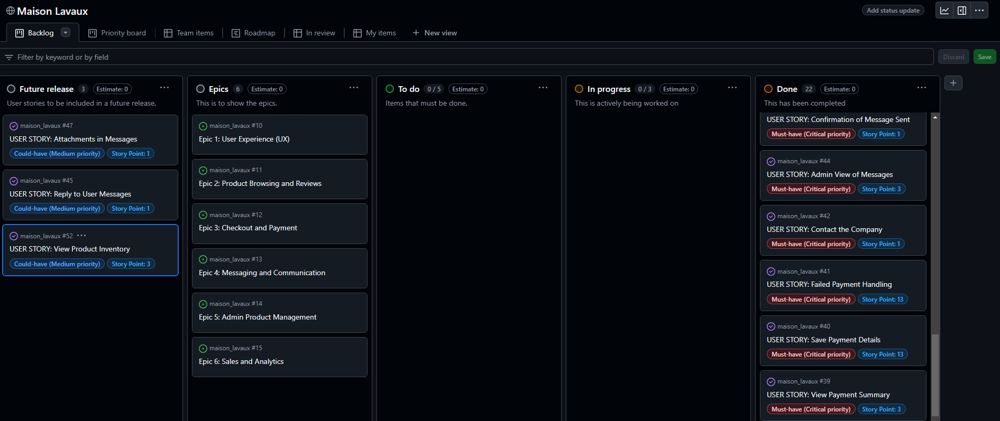
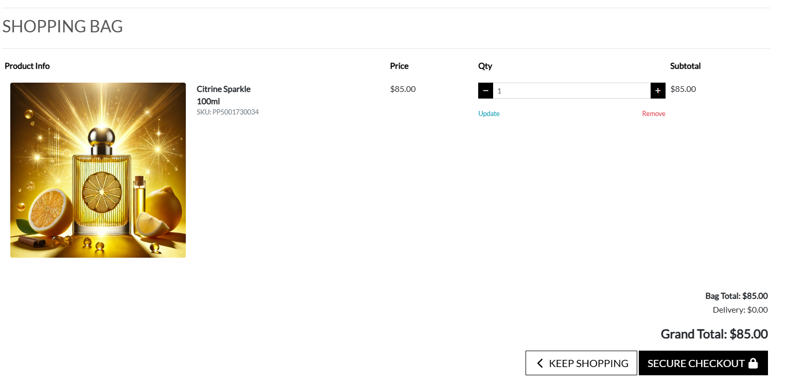
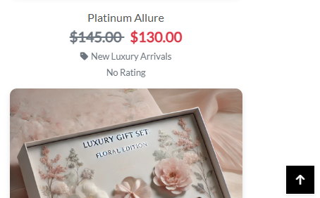
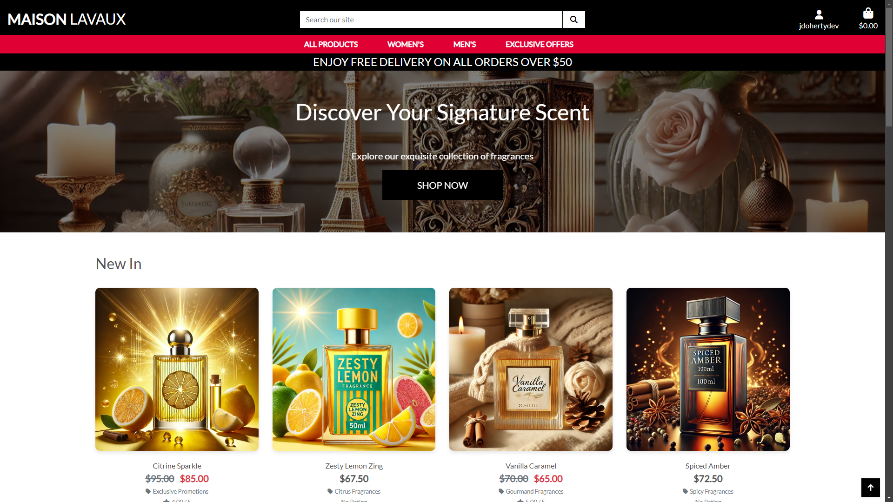

# Maison Lavaux Perfumery

## Introduction

Maison Lavaux is a fully functional e-commerce platform specialising in boutique perfumes, inspired by the fictitious luxury brand from the hit series Emily in Paris. The site is designed to provide customers with an elegant and seamless shopping experience, offering exclusive and sophisticated fragrances.

## Purpose

The purpose of Maison Lavaux is to cater to perfume enthusiasts who value unique, boutique-style products and a premium shopping experience. The platform is designed for:

- Customers seeking handcrafted, luxurious perfumes tailored for both men and women.
- Busy users who require an intuitive and efficient shopping experience, including mobile-friendly navigation and streamlined checkouts.
- Returning shoppers who appreciate personalised recommendations, order history tracking, and secure account features.

By addressing these specific needs, Maison Lavaux aims to bridge the gap between boutique perfume brands and their online clientele.


View the live version of the website at [Maison Lavaux](https://maison-lavaux-ebcf574677ab.herokuapp.com/).

- [Maison Lavaux Perfumery](#maison-lavaux-perfumery)
  - [Introduction](#introduction)
  - [Purpose](#purpose)
  - [User Experience](#user-experience)
    - [Initial Discussion](#initial-discussion)
    - [Epics](#epics)
    - [User Stories](#user-stories)
    - [Owner/Admin and Developer Goals](#owneradmin-and-developer-goals)
    - [First-Time Visitor Goals](#first-time-visitor-goals)
    - [Returning Visitor Goals](#returning-visitor-goals)
  - [Design](#design)
    - [Colour Scheme](#colour-scheme)
        - [Colour Palette](#colour-palette)
    - [Typography](#typography)
    - [Wireframes](#wireframes)
      - [Desktop](#desktop)
      - [Mobile](#mobile)
    - [Database Entity Relationship Diagram](#database-entity-relationship-diagram)
    - [Relationships in the ERD](#relationships-in-the-erd)
    - [Agile Development](#agile-development)
      - [User Stories and Epics](#user-stories-and-epics)
      - [MoSCoW Prioritization](#moscow-prioritization)
      - [Story Points](#story-points)
      - [Iterations and Milestones](#iterations-and-milestones)
      - [Kanban Board](#kanban-board)
  - [Features](#features)
    - [Base Template File](#base-template-file)
      - [Favicon Implementation](#favicon-implementation)
      - [Meta Tags](#meta-tags)
      - [CSS and JavaScript Includes](#css-and-javascript-includes)
      - [Navigation Bar](#navigation-bar)
      - [Footer with Social Media and Newsletter Signup](#footer-with-social-media-and-newsletter-signup)
      - [Dynamic Content Blocks](#dynamic-content-blocks)
      - [Toast Notifications](#toast-notifications)
      - [Dynamic Year Display](#dynamic-year-display)
    - [Home Page](#home-page)
      - [Dynamic Hero Section](#dynamic-hero-section)
      - [Curated Product Sections](#curated-product-sections)
      - [Interactive Product Cards](#interactive-product-cards)
      - [Responsive and Accessible Design](#responsive-and-accessible-design)
      - [Back-to-Top Button](#back-to-top-button)
      - [Search Engine Optimization (SEO)](#search-engine-optimization-seo)
    - [Products Page](#products-page)
      - [Dynamic Price Calculation](#dynamic-price-calculation)
      - [Seamless Product Display with Inactive Item Exclusion](#seamless-product-display-with-inactive-item-exclusion)
      - [Pagination for Product Pages](#pagination-for-product-pages)
    - [Product Details Page](#product-details-page)
      - [Dynamic Product Information](#dynamic-product-information)
      - [Image Handling](#image-handling)
      - [Stock Management](#stock-management)
      - [Add to Bag Functionality](#add-to-bag-functionality)
      - [Category Navigation](#category-navigation)
      - [Superuser Capabilities](#superuser-capabilities)
      - [Mobile-Responsive Design](#mobile-responsive-design)
      - [JavaScript Integration](#javascript-integration)
      - [Meta Tags for SEO](#meta-tags-for-seo)
      - [Accessible Navigation](#accessible-navigation)
      - [Product Review](#product-review)
        - [How the Product Review Feature Works](#how-the-product-review-feature-works)
        - [Why This Feature is Useful](#why-this-feature-is-useful)
    - [Shopping Bag (Basket) Features](#shopping-bag-basket-features)
      - [Backend Features](#backend-features)
      - [Frontend Features](#frontend-features)
    - [Checkout Page / Checkout Success](#checkout-page--checkout-success)
      - [Backend Features](#backend-features-1)
      - [Frontend Features](#frontend-features-1)
      - [Order Confirmation Email](#order-confirmation-email)
      - [Using Django Humanize for Displaying Amounts](#using-django-humanize-for-displaying-amounts)
        - [Benefits](#benefits)
    - [Profile Page](#profile-page)
      - [Backend Features](#backend-features-2)
      - [Frontend Features](#frontend-features-2)
      - [Key Features](#key-features)
    - [Add / Edit / Products Page](#add--edit--products-page)
      - [Add Product Functionality](#add-product-functionality)
      - [Edit Product Functionality](#edit-product-functionality)
      - [Delete Product Functionality](#delete-product-functionality)
      - [Access Control](#access-control)
    - [Admin Panel](#admin-panel)
      - [Purpose and Benefits](#purpose-and-benefits)
    - [Analytics App](#analytics-app)
      - [Key Features](#key-features-1)
      - [Why This is Useful](#why-this-is-useful)
      - [Improvements Over Basic Applications](#improvements-over-basic-applications)
    - [Toast Messaging](#toast-messaging)
    - [Privacy Policy](#privacy-policy)
    - [About Us Page](#about-us-page)
      - [Key Features](#key-features-2)
      - [Purpose](#purpose-1)
    - [Contact Page](#contact-page)
      - [Key Features](#key-features-3)
      - [Admin Features](#admin-features)
    - [Custom Error Pages](#custom-error-pages)
      - [Key Features](#key-features-4)
      - [Email Verification](#email-verification)
      - [Benefits](#benefits-1)
    - [Back to Top Button](#back-to-top-button-1)
      - [Implementation Details](#implementation-details)
      - [Benefits for User Experience](#benefits-for-user-experience)
    - [Basket Badge](#basket-badge)
    - [Form Validation](#form-validation)
    - [Future Implementations](#future-implementations)
    - [Accessibility and Good Practice](#accessibility-and-good-practice)
  - [E-Commerce Business Model](#e-commerce-business-model)
    - [Search Engine Optimization (SEO)](#search-engine-optimization-seo-1)
    - [Social Media Marketing](#social-media-marketing)
    - [Newsletter Marketing](#newsletter-marketing)
  - [Future Strategies to Support the E-Commerce Business Model](#future-strategies-to-support-the-e-commerce-business-model)
    - [Advanced SEO Techniques](#advanced-seo-techniques)
    - [Expanded Social Media Marketing](#expanded-social-media-marketing)
    - [Email Marketing Enhancements](#email-marketing-enhancements)
    - [Customer Loyalty Programs](#customer-loyalty-programs)
    - [Mobile App Development](#mobile-app-development)
    - [Data-Driven Decision Making](#data-driven-decision-making)
    - [Diversified Product Offerings](#diversified-product-offerings)
    - [International Expansion](#international-expansion)
  - [Technologies Used](#technologies-used)
    - [Languages](#languages)
    - [Frameworks](#frameworks)
    - [Databases Used](#databases-used)
    - [Libraries, Modules, and Packages](#libraries-modules-and-packages)
    - [Version Control](#version-control)
    - [Programs and Tools](#programs-and-tools)
    - [Hosting and Deployment](#hosting-and-deployment)
  - [Dependency Setup, Deployment and Local Deployment](#dependency-setup-deployment-and-local-deployment)
    - [Create and Connect a Database](#create-and-connect-a-database)
      - [Why Is a Remote Database Needed?](#why-is-a-remote-database-needed)
      - [Steps to Create a PostgreSQL Database](#steps-to-create-a-postgresql-database)
      - [Connecting the Database to the Project](#connecting-the-database-to-the-project)
      - [Final Integration](#final-integration)
    - [Amazon Web Services (AWS) Setup for Static Files and Images](#amazon-web-services-aws-setup-for-static-files-and-images)
      - [S3 Configuration](#s3-configuration)
      - [IAM Configuration](#iam-configuration)
      - [Adding Users](#adding-users)
      - [Project Configuration](#project-configuration)
    - [Payment System Setup](#payment-system-setup)
    - [Stripe Setup for Payment Processing](#stripe-setup-for-payment-processing)
      - [Steps to Configure Stripe](#steps-to-configure-stripe)
      - [Email Server Configuration](#email-server-configuration)
      - [Environment Variables](#environment-variables)
      - [Testing the Email System in the Bash Terminal](#testing-the-email-system-in-the-bash-terminal)
      - [Notes for Testing](#notes-for-testing)
    - [Deployment to Heroku](#deployment-to-heroku)
      - [Pre-Deployment Checklist](#pre-deployment-checklist)
      - [Steps to Deploy the Application on Heroku](#steps-to-deploy-the-application-on-heroku)
      - [Notes](#notes)
    - [Local Deployment](#local-deployment)
    - [How to Fork the Repository](#how-to-fork-the-repository)
    - [How to Clone the Repository](#how-to-clone-the-repository)
      - [Testing Procedure](#testing-procedure)
        - [Prerequisites](#prerequisites)
        - [Steps to Test the Project](#steps-to-test-the-project)
        - [Troubleshooting](#troubleshooting)
  - [Validation, Testing and Bugs](#validation-testing-and-bugs)
    - [Validation](#validation)
      - [Manual Testing for PEP8 Compliance](#manual-testing-for-pep8-compliance)
      - [HTML Validation](#html-validation)
      - [CSS Validation](#css-validation)
      - [JS Validation](#js-validation)
      - [Codebase Cleanup](#codebase-cleanup)
        - [Reason for Deletion](#reason-for-deletion)
    - [Lighthouse Audit Results](#lighthouse-audit-results)
  - [Testing](#testing)
    - [User Stories Testing](#user-stories-testing)
    - [Automated Testing](#automated-testing)
    - [Manual Testing](#manual-testing)
    - [Manual Testing](#manual-testing-1)
      - [**1. Create Operations**](#1-create-operations)
      - [**2. Read Operations**](#2-read-operations)
      - [**3. Update Operations**](#3-update-operations)
      - [**4. Delete Operations**](#4-delete-operations)
      - [**5. Edge Cases for Stock Validation**](#5-edge-cases-for-stock-validation)
    - [Viewport Testing](#viewport-testing)
      - [Screenshot - Desktop](#screenshot---desktop)
      - [Screenshot - Tablet](#screenshot---tablet)
      - [Screenshot - Mobile](#screenshot---mobile)
    - [Compatibility Testing](#compatibility-testing)
      - [Comparing Chrome and Edge](#comparing-chrome-and-edge)
    - [Bugs](#bugs)
      - [Bug 1: Quantity Controls - Duplicate IDs](#bug-1-quantity-controls---duplicate-ids)
      - [Bug 2: HTML Validation Error - `for` Attribute in Form Label](#bug-2-html-validation-error---for-attribute-in-form-label)
  - [Acknowledgements](#acknowledgements)

## User Experience

### Initial Discussion

### Epics

In website development, epics are high-level objectives that represent major areas of functionality or user needs. Each epic encompasses multiple user stories, providing structure and clarity in the development process. They ensure all work aligns with the overarching goals of the project and facilitate tracking progress across related features. These are the epics I chose for my project:

1. User Experience (UX) [#10](https://github.com/jdohertydev/maison_lavaux/issues/10)
2. Product Browsing and Reviews [#11](https://github.com/jdohertydev/maison_lavaux/issues/11)
3. Checkout and Payment [#12](https://github.com/jdohertydev/maison_lavaux/issues/12)
4. Messaging and Communication [#13](https://github.com/jdohertydev/maison_lavaux/issues/13)
5. Admin Product Management [#14](https://github.com/jdohertydev/maison_lavaux/issues/14)
6. Sales and Analytics [#15](https://github.com/jdohertydev/maison_lavaux/issues/15)

### User Stories

User stories are short, simple descriptions of a feature or functionality told from the perspective of the end user. They help ensure the development process remains user-focused, aligning each task with specific user needs and goals. Below are the user stories I created for my project:

### Owner/Admin and Developer Goals
- As an admin, I can assign products to specific categories so that users can find them more easily during browsing. [#53](https://github.com/jdohertydev/maison_lavaux/issues/53)
- As an admin, I can temporarily hide products from the storefront so that users don’t see items that are being updated or out of stock. [#54](https://github.com/jdohertydev/maison_lavaux/issues/54)
- As an admin, I can view a summary of product inventory so that I can monitor stock levels easily. [#52](https://github.com/jdohertydev/maison_lavaux/issues/52)
- As an admin, I can upload, update, or delete product images so that products are visually appealing and well-represented. [#51](https://github.com/jdohertydev/maison_lavaux/issues/51)
- As an admin, I can edit existing product details (e.g., name, price, description, stock) so that the catalogue stays accurate and up-to-date. [#49](https://github.com/jdohertydev/maison_lavaux/issues/49)
- As an admin, I can add new products to the catalogue so that users can see and purchase the latest items available. [#48](https://github.com/jdohertydev/maison_lavaux/issues/48)
- As an admin, I can delete products from the catalogue so that unavailable items no longer appear on the site. [#50](https://github.com/jdohertydev/maison_lavaux/issues/50)
- As an admin, I can sort products in the admin panel by various criteria (e.g., name, price, stock level) so that I can manage the catalogue more efficiently. [#55](https://github.com/jdohertydev/maison_lavaux/issues/55)
- As an admin, I can compare the performance of multiple products side by side so that I can make informed inventory or marketing decisions. [#62](https://github.com/jdohertydev/maison_lavaux/issues/62)
- As an admin, I can sort analytics data (e.g., revenue, views, purchases) so that I can prioritise metrics most relevant to my goals. [#61](https://github.com/jdohertydev/maison_lavaux/issues/61)
- As an admin, I can view a list of the top-selling products so that I can focus on promoting high-performing items. [#60](https://github.com/jdohertydev/maison_lavaux/issues/60)
- As an admin, I can filter sales and analytics data by specific time periods (e.g., weekly, monthly) so that I can assess trends and plan strategies effectively. [#59](https://github.com/jdohertydev/maison_lavaux/issues/59)
- As an admin, I can analyse revenue trends over time so that I can evaluate overall business performance. [#58](https://github.com/jdohertydev/maison_lavaux/issues/58)
- As an admin, I can track the number of purchases for each product so that I can determine which items are most popular. [#57](https://github.com/jdohertydev/maison_lavaux/issues/57)
- As an admin, I can view the number of page views for each product so that I can identify which products attract the most interest. [#56](https://github.com/jdohertydev/maison_lavaux/issues/56)
- As an admin, I can view all messages submitted by users in a structured format so that I can respond to inquiries efficiently. [#44](https://github.com/jdohertydev/maison_lavaux/issues/44)
- As an admin, I can send responses to user messages directly from the admin panel so that I can address their concerns quickly. [#45](https://github.com/jdohertydev/maison_lavaux/issues/45)
- As an admin, I can access a secure checkout process so that I feel confident that my payment details are safe. [#35](https://github.com/jdohertydev/maison_lavaux/issues/35)
- As an admin, I can process payments using Stripe so that I can handle transactions securely and reliably. [#36](https://github.com/jdohertydev/maison_lavaux/issues/36)

### First-Time Visitor Goals
- As a user, I can fill out a contact form on the website so that I can send inquiries or feedback to the company. [#42](https://github.com/jdohertydev/maison_lavaux/issues/42)
- As a user, I can see a detailed breakdown of my order total, including discounts and shipping, so that I understand the final price I am paying. [#39](https://github.com/jdohertydev/maison_lavaux/issues/39)
- As a user, I can receive an email confirmation after completing my order so that I know my transaction was successful. [#38](https://github.com/jdohertydev/maison_lavaux/issues/38)
- As a user, I can view a summary of the products in my cart so that I can confirm my order is correct before checkout. [#33](https://github.com/jdohertydev/maison_lavaux/issues/33)
- As a user, I can experience a clean and professional design so that I feel confident shopping on a high-quality website. [#16](https://github.com/jdohertydev/maison_lavaux/issues/16)
- As a user, I can access a clear and well-organised navigation menu so that I can find the information or products I need without frustration. [#17](https://github.com/jdohertydev/maison_lavaux/issues/17)
- As a user, I can access the website on my mobile device so that I can browse and shop seamlessly on the go. [#18](https://github.com/jdohertydev/maison_lavaux/issues/18)
- As a user, I can see visual or textual feedback when interacting with elements (e.g., buttons or forms) so that I know my actions have been registered. [#19](https://github.com/jdohertydev/maison_lavaux/issues/19)
- As a user with disabilities, I can use assistive technologies (e.g., screen readers) to navigate the site so that I can access the same features as any other user. [#20](https://github.com/jdohertydev/maison_lavaux/issues/20)
- As a user, I can experience minimal load times on every page so that I don't lose interest or abandon the site. [#21](https://github.com/jdohertydev/maison_lavaux/issues/21)

### Returning Visitor Goals
- As a returning user, I can securely save my payment details so that future purchases are faster and easier. [#40](https://github.com/jdohertydev/maison_lavaux/issues/40)
- As a returning user, I can manage my saved payment methods so that I can update or delete them as needed. [#40](https://github.com/jdohertydev/maison_lavaux/issues/40)
- As a returning user, I can apply discount codes or promotional offers to my order so that I can save money. [#39](https://github.com/jdohertydev/maison_lavaux/issues/39)
- As a returning user, I can review my previous purchases so that I can reorder or track my past orders. [#38](https://github.com/jdohertydev/maison_lavaux/issues/38)
- As a returning user, I can leave reviews for products I’ve purchased so that I can share feedback with other users. [#34](https://github.com/jdohertydev/maison_lavaux/issues/34)

## Design

The colour scheme for the website was carefully selected to reflect the brand's sophisticated and elegant identity. Black and white were chosen as the primary colours, as they convey a timeless and refined aesthetic while also being the simplest and most effective for accessibility. To complement this monochromatic foundation, a rose red was introduced as an accent colour. This striking yet classy choice adds a touch of warmth and distinction, making it perfect for highlighting key elements such as calls to action and interactive features. The result is a clean, accessible, and visually appealing design that aligns seamlessly with the brand's ethos.

### Colour Scheme

##### Colour Palette

The following colours were chosen to create a sleek, sophisticated, and accessible design for the website:

| Colour        | Hex Code   | Usage                                      |
|---------------|------------|--------------------------------------------|
| **Black**     | `#000000`  | Backgrounds, buttons, overlays, text       |
| **White**     | `#FFFFFF`  | Text, light backgrounds, buttons, forms    |
| **Rose Red**  | `#E00034`  | Navigation bar, accents, attention-grabbing|
| **Grey**      | `#555555`  | General text                              |
| **Light Grey**| `#F1F1F1`  | Hover effects, subtle backgrounds          |
| **Muted Grey**| `#6C757D`  | Muted text, secondary content              |

To further enhance the design process, the palette was visualised using [Coolors](https://coolors.co/), allowing for a clear and cohesive representation of the chosen colours.


The colour palette used for the website was tested using [WAVE Web Accessibility Evaluation Tool](https://wave.webaim.org/) and achieved a score of **0 contrast errors**, ensuring the design meets accessibility standards and provides excellent readability for users.

### Typography

For the website's typography, I selected the **Lato** font. Lato was chosen because it is clean, modern, and versatile, while also offering a sense of sophistication that aligns well with the brand's classy and elegant identity. Its wide variety of weights makes it suitable for both headings and body text, ensuring consistency across the site.

Lato was also used for the website logo, presented in uppercase to create a bold and striking impression that reinforces the brand's elegance and professionalism.


To ensure accessibility and functionality across all devices and browsers, I included a fallback font stack. If Lato is unavailable, the design defaults to a generic sans-serif font, maintaining readability and visual appeal.

### Wireframes

All wireframes for the website were designed using the **Balsamiq Desktop Application**. These wireframes served as the foundation for planning the website's layout and user experience across different devices. 

Below, you can find examples of how a typical page is structured on both desktop and mobile devices.

#### Desktop


#### Mobile


### Database Entity Relationship Diagram

The Entity Relationship Diagram (ERD) below represents the models in the database and their relationships. The database consists of the following 11 models:

1. auth_user
2. analytics_salesdata
3. products_product
4. products_category
5. profiles_userprofile
6. products_review
7. account_emailaddress
8. account_emailconfirmation
9. checkout_order
10. checkout_orderlineitem
11. contact_contactmessage

### Relationships in the ERD

1. The profiles_userprofile model has a one-to-one relationship with the auth_user model, as each user can have only one profile.

2. The analytics_salesdata model has:
   - A one-to-many (Foreign Key) relationship with the products_product model, as each product can have many analytics records.
   - A one-to-many (Foreign Key) relationship with the auth_user model, as multiple analytics records can be associated with one user.

3. The products_product model has a one-to-many (Foreign Key) relationship with the products_category model, as each product belongs to one category, but a category can have many products.

4. The products_review model has:
   - A one-to-many (Foreign Key) relationship with the auth_user model, as one user can post many reviews.
   - A one-to-many (Foreign Key) relationship with the products_product model, as one product can have many reviews.

5. The account_emailaddress model has a one-to-one relationship with the auth_user model, as each user can have one primary email address.

6. The account_emailconfirmation model has a one-to-many (Foreign Key) relationship with the account_emailaddress model, as one email address can have multiple confirmations.

7. The checkout_order model has a one-to-many (Foreign Key) relationship with the profiles_userprofile model, as one user profile can have many orders.

8. The checkout_orderlineitem model has:
   - A one-to-many (Foreign Key) relationship with the checkout_order model, as one order can have many line items.
   - A one-to-many (Foreign Key) relationship with the products_product model, as many line items can represent one product.

9. The contact_contactmessage model has a one-to-many (Foreign Key) relationship with the auth_user model, as one user can send many contact messages.

Below is the Entity Relationship Diagram (ERD) for the Maison Lavaux project, which visualises the relationships between the various models in the database.


### Agile Development

For the development of this project, I adopted **Agile development** methodologies to ensure a flexible and iterative approach. The process was structured around **epics**, **user stories**, **acceptance criteria**, and **tasks**, allowing for continuous feedback and improvement throughout the project. To prioritise features effectively, I employed **MoSCoW prioritisation**—which helped categorise requirements based on their importance. Additionally, **story points** were used to estimate the effort required for each task, allowing for better planning and tracking of progress in each sprint. This Agile approach ensured that the project remained adaptable and focused on delivering value to the users.

#### User Stories and Epics

During the project planning stage, I took the time to thoroughly consider and define the functional requirements for the website. I reflected deeply on the website's goals, its target audience, and the features that would best serve the users. Based on this reflection, I identified the core functionalities needed for the site.

After finalising this list of functional requirements, I converted them into user stories, represented as issues on GitHub. Any requirement that was too large to be considered a single user story was labelled as an **Epic**, and the related user stories were grouped under that epic. This approach allowed me to break down larger tasks into smaller, manageable pieces.

From the requirements, I created **6 epics** and additional user stories, totalling **45 user stories**. As the development progressed, some issues were identified as bugs, which were also tracked as user stories. For every epic that was created, all related user stories were referenced within that epic, ensuring clear tracking of tasks and progress.

#### MoSCoW Prioritization

Having created the user stories, I used **MoSCoW prioritisation** to ensure that the most important requirements were addressed first. MoSCoW is a useful technique for managing project scope and ensuring that critical tasks are prioritised, while also providing flexibility in the development process. Here's how I applied the MoSCoW method:

- **Must-Have**: Critical requirements that are essential for project success.
- **Should-Have**: Important requirements that significantly add value.
- **Could-Have**: Desirable features that provide additional benefits.
- **Won't-Have**: Features explicitly excluded from the project scope.

This method is beneficial as it allows for clear communication about what will be delivered in each iteration. It ensures that essential features are prioritised, while also managing expectations by clearly defining what will not be included. By using MoSCoW prioritisation, I was able to focus on delivering the highest value to users and stakeholders first, while still maintaining the flexibility to address lower-priority features later in the project.

#### Story Points

In this project, story points were used to estimate the relative complexity of each user story, enabling efficient time management and iteration planning. Each story was assigned a point value of 1, 2, 3, 5, 8, 13, or 21 based on the Fibonacci sequence, which provides a non-linear scale to account for increasing uncertainty with more complex tasks. By analysing the tasks and acceptance criteria for each story, I determined its difficulty relative to others, ensuring a realistic assessment of workload. This method facilitated the prediction of solo velocity for each iteration, aiding in the planning of future development cycles and prioritisation of features.

#### Iterations and Milestones

To organise and manage progress, I divided the project into 7 weekly iterations, each represented by a milestone in GitHub. 

- Story Point Allocation: User stories were prioritised and assigned story points to estimate effort. The total story points were divided evenly across the 7 iterations.
- Adding to Iterations: At the start of each iteration, user stories were added until their total story points matched the planned weekly workload.
- Adjustments: Incomplete tasks at the end of an iteration were moved back to the backlog for refinement and included in the next iteration.

This approach ensured steady progress throughout the project while allowing flexibility to adjust as needed.

#### Kanban Board

To manage and track the progress of user stories during the project, I created a Kanban Board board. The board was divided into four columns: **Epics**, **To Do**, **In Progress**, and **Done**.

- Epics: This column contained overarching goals that grouped related user stories together.
- To Do: At the start of each iteration, user stories to be completed were moved here.
- In Progress: As work began on a user story, it was moved to this column.
- Done: Completed user stories were moved to this column to indicate they were finished.

This setup provided a clear and simple way to track the status of tasks throughout the project, ensuring that progress was organised and transparent.

**Github Kanboard During Development**



You can view the [Maison Lavaux Kanban Board](https://github.com/users/jdohertydev/projects/6/) for a detailed overview of the project's progress and task management.

## Features

### Base Template File
For my project, the `base.html` template serves as the foundation for the overall structure and layout of the website. By centralising common elements such as the header, footer, and navigation in a single file, it ensures consistency across all pages and simplifies maintenance. This approach allows individual pages to focus on their unique content while inheriting the shared layout and functionality from the base template. From the `base.html` template, the following features are included on every page within the project:

#### Favicon Implementation

A favicon has been added to Maison Lavaux to enhance the branding and user experience. Favicons are small icons that appear in browser tabs, bookmarks, and history, helping users to easily recognize and return to a website. Including a favicon improves the website's professionalism and strengthens brand recognition, ensuring Maison Lavaux stands out visually among other tabs and saved pages.

The favicon uses the 'Quintessential' font to form initials and a white font and background color #E00034 to maintain consistency with the colors used on the main site. It was created by using [Favicon Generator](https://favicon.io/favicon-generator/).


#### Meta Tags
- Essential meta tags, including character encoding, viewport settings for responsiveness, and a default meta description that can be customised on individual pages.

#### CSS and JavaScript Includes
- Core CSS includes such as Bootstrap, Google Fonts, and custom styles from `base.css`.
- JavaScript libraries such as jQuery, Popper.js, Bootstrap JS, and Stripe for payment integration.
- Additional, page-specific CSS and JavaScript can be added via block tags (`corecss`, `extra_css`, `corejs`, `extra_js`).

#### Navigation Bar
- A fixed-top navbar with search functionality, user account options (login, profile, logout), and a shopping cart icon displaying the number of items in the cart.
- Dynamic greeting for logged-in users with their username or a "My Account" label for guests.
  
  
#### Footer with Social Media and Newsletter Signup
- The header includes the website logo, main navigation, and a delivery banner for promotions.
- The footer contains links to information pages, social media profiles, and a newsletter subscription form.

  

- External links include the rel="noopener noreferrer" attribute for the following reasons:
  - Security: Prevents security risks like tabnabbing by disabling access to the window.opener object.
  - Performance: Improves browser performance by not retaining references to the original tab.
  - Privacy: Stops the browser from sending the referring URL to the destination website.

#### Dynamic Content Blocks
- Custom content areas such as `meta`, `page_header`, and `content` are made flexible through the use of `` tags, allowing pages to easily modify or extend these areas.

#### Toast Notifications
- Displays dynamic notifications (success, error, warning, info) based on messages in the request context.

#### Dynamic Year Display
- The current year is dynamically displayed in the footer using JavaScript, ensuring the copyright information remains up-to-date.

These features ensure a consistent user experience and allow for easy customisation of content across different pages, improving the maintainability and scalability of the project.

### Home Page

The homepage of Maison Lavaux is thoughtfully designed to provide an engaging and seamless user experience while showcasing our luxurious perfume collection. Below are the standout features:

#### Dynamic Hero Section
- A captivating hero banner featuring a high-resolution image, a dynamic overlay message, and a compelling call-to-action button directing users to browse the product catalog.
  
- The overlay includes slogan that changes every 5 seconds using JS (*"Discover Your Signature Scent", "Find the Perfect Fragrance for Any Occasion", "Unleash Your True Essence"*) to inspire visitors and enhance brand identity.

#### Curated Product Sections

The homepage offers multiple product categories, each tailored to meet diverse customer preferences:

- **New In**: Showcases the latest products added in the past 30 days, keeping the catalog fresh and exciting.

  ```python
  # New In Section (last 30 days)
    new_in_products = Product.objects.filter(
        created_at__gte=thirty_days_ago, is_active=True
    ).order_by('-created_at')[:4]
  ```
- **For Him and For Her**: Gender-specific product recommendations for a more personalized shopping experience.

  ```python
  # For Him Section (products for men)
  for_him_products = Product.objects.filter(
      gender='M', is_active=True
  ).order_by('-created_at')[:4]

  # For Her Section (products for women)
  for_her_products = Product.objects.filter(
      gender='W', is_active=True
  ).order_by('-created_at')[:4]
  ```
- **Most Popular**: Highlights the best-selling products based on revenue generated, leveraging data-driven insights.

  ```python
  # Most Popular Section (top 4 products by revenue)
  most_popular_products = Product.objects.annotate(
      total_revenue=Sum('sales_data__revenue_generated')
  ).order_by('-total_revenue')[:4]
  ```
- **Highest Rated**: Features top-rated products as reviewed by customers, ensuring quality recommendations.

  ```python
  # Highest Rated Section (top 4 highest rated products)
  highest_rated_products = Product.objects.filter(
      rating__isnull=False, is_active=True
  ).order_by('-rating')[:4]
  ```
- **Pot Luck**: A surprise selection of four random active products, encouraging discovery and delight.

  ```python
  # Pot Luck Section (random 4 active products)
  all_active_products = Product.objects.filter(is_active=True)
  random_products = random.sample(
      list(all_active_products), 4
  ) if all_active_products else []
  ```

#### Interactive Product Cards

- Each product card is designed with user engagement in mind, displaying:
  - High-quality product images with fallback placeholders.
  - Product names, categories, dynamic pricing (including original and discounted prices), and star ratings.
  
  - Interactive tags and links for easy navigation to related categories.
  - CSS styling:
    - Rounded Corners: The `border-radius: 10px` softens the edges of the product card image, creating a more polished and visually appealing look.  
    - Hover Animation: On hover, the `transform: scale(1.05)` slightly enlarges the image, drawing attention to it and making the product stand out.  
    - Dynamic Shadows: The `box-shadow` effect deepens on hover, giving the image a "pop" effect as if it's lifting off the background, enhancing the user's interactive experience.  
    - Smooth Transition: The `transition: transform 0.3s ease, box-shadow 0.3s ease` ensures the hover effects are fluid and natural, making the interaction feel seamless and engaging.  

#### Responsive and Accessible Design
- Fully responsive layout ensuring a smooth browsing experience across desktop, tablet, and mobile devices.
- Alt text for images and semantic HTML elements to enhance accessibility for screen readers.

#### Back-to-Top Button
- A persistent "Back to Top" button allows users to navigate long pages effortlessly, improving overall usability. See [Back to Top Button](#back-to-top-button-1).

#### Search Engine Optimization (SEO)
- Includes a descriptive meta tag: 
   *"Welcome to Maison Lavaux, your destination for handcrafted perfumes made in Paris. Explore our exclusive collection for men and women, featuring new arrivals, top-rated scents, and unique fragrances for every occasion."*
- This improves search visibility and effectively communicates the brand’s unique selling points.

By integrating these features, the homepage sets the tone for an exceptional online shopping experience while reinforcing the Maison Lavaux brand identity.

### Products Page

The products page on this site displays a dynamic catalogue of items available for purchase, allowing users to browse through a range of products, filter them by category, and sort them based on various criteria such as price, rating, or name. 


Each product card on the products page displays the following details:

- Product Image: A clear, high-quality image representing the product.
- Product Name: The name of the product, which links to its individual detail page.
- Price: The regular price of the product, with any applicable discounts displayed alongside.
- Discounted Price: If a product is on sale, the discounted price is displayed prominently.
- Product Rating: The product's average rating, shown as stars (if available).
- Category: The product’s category, with a link to view more products from the same category.

This ensures that users have a comprehensive view of each product at a glance, making it easier to decide on their purchases.

#### Dynamic Price Calculation

The dynamic price calculation feature ensures that users always see the most relevant pricing on the site. By prioritizing discounted prices when available, this functionality provides clarity and transparency, improving the overall shopping experience. It integrates seamlessly with sorting and filtering systems, enabling accurate and user-friendly price displays. 


- Ensures the most relevant price is displayed by prioritizing `discount_price` over the regular `price`.
- Utilizes Django's `annotate` method to create an `effective_price` field dynamically.
- Checks if a `discount_price` exists:
- If available, `effective_price` uses the `discount_price`.
- Otherwise, it defaults to the regular `price`.
- Fully integrated into product querysets, enabling:
- Dynamic sorting by `effective_price` (ascending or descending).
- Filtering and display of accurate prices across the site.
- Simplifies backend operations while ensuring consistent and accurate pricing for users.

#### Seamless Product Display with Inactive Item Exclusion

A key feature of this page is that products marked as inactive (`is_active = models.BooleanField(default=True)`) are automatically excluded from the display. This ensures that only available products are shown to the user, enhancing the shopping experience by preventing frustration  items. The page provides an intuitive and responsive layout with sorting options and real-time updates, ensuring a smooth and engaging shopping experience.

#### Pagination for Product Pages

A key feature missing from the walkthrough project *Boutique Ado* was pagination for the product pages, which I identified as an area for improvement. To enhance the user experience and improve site performance, I implemented pagination on the product pages. This feature divides the product listings into multiple pages, making it easier for users to browse large numbers of items without long load times. Each page displays a manageable number of products, and users can navigate through the available pages using the pagination controls. 


This functionality not only helps in presenting a more organised and responsive layout but also reduces server load by limiting the amount of data fetched at once. The pagination system is designed to be intuitive and user-friendly, providing clear navigation options for seamless browsing across various product categories.

### Product Details Page

#### Dynamic Product Information
- Displays detailed product information, including:
  - Name
  - Price (supports both original and discounted prices)
  - Category
  - Description
  - Size
  - Stock status
- Automatically adjusts for discounted products by showing both the original and discounted prices.


#### Image Handling
- Displays the product image if available.
- Provides a fallback "no image available" placeholder for missing images.
- Allows users to view the full-size image by clicking on it.
- Uses `alt` attributes to provide descriptive text for images, improving accessibility for screen readers and enhancing the user experience for visually impaired users.

#### Stock Management
- Provides dynamic stock status updates:
  - In Stock message for ample availability.
  - Hurry! warning is triggered when the stock quantity is greater than 0 but less than or equal to 5.
  - Out of Stock alert is triggered when the stock quantity is 0, with the "Add to Bag" button disabled for unavailable items.

#### Add to Bag Functionality
- Users can select the desired quantity using:
  - Increment and decrement buttons.
  - Direct input (supports quantities between 1 and 99).
- Ensures a smooth shopping experience by redirecting users back to the product page after adding to the bag.

#### Category Navigation
- Includes a link to related products by category, making it easy for users to explore similar items.

#### Superuser Capabilities
- Superusers have access to additional controls, such as:
  - Edit button to update product details.
  - Delete button with a modal confirmation to prevent accidental actions. This feature addresses a limitation in the Boutique Ado project, which lacked a confirmation step for deletions.

#### Mobile-Responsive Design
- Fully responsive layout optimized for various screen sizes, ensuring a seamless experience on mobile, tablet, and desktop devices.

#### JavaScript Integration
- Uses custom JavaScript for interactive features, such as:
  - Quantity adjustment buttons for selecting product quantities.

#### Meta Tags for SEO
- Includes dynamic meta descriptions for each product, enhancing search engine optimization and discoverability.

#### Accessible Navigation
- Features a "Keep Shopping" button that redirects users back to the main product catalog, allowing for easy navigation.

#### Product Review

The product review functionality is an integral part of the application, enabling users to provide feedback on products, rate their quality, and share their experiences with other potential buyers. Below is an explanation of how the feature works and why it is a significant improvement over the Boutique Ado project.

  

##### How the Product Review Feature Works

1. Dynamic Rating Update
   - The product's average rating dynamically updates whenever a new review is added or edited. This ensures that the displayed rating always reflects the latest user feedback.

2. Adding a Review
   - Authenticated users can submit a review for a product by filling in a form that includes a star rating and a comment.
   - The system checks if the user has already reviewed the product. If a review exists, they are notified that only one review per user is allowed.
  

3. Editing a Review
   - Users can edit their existing reviews. The form pre-fills with the user's current review details, allowing for easy updates, and any changes are saved back to the database.

4. Deleting a Review
   - Users can delete their reviews if they no longer wish to share their feedback. The review is permanently removed from the database upon confirmation.

5. Authentication Requirement
   - Only logged-in users can add, edit, or delete reviews. Unauthenticated users are prompted to log in, with their current page preserved as the redirect URL for a seamless experience.

6. Visibility on Product Pages
   - All reviews for a product are displayed on its detail page, showing:
     - Star rating
     - Review text
     - Date of posting
     - Reviewer's username

7. Review Management by Superusers
   - While reviews are primarily user-driven, superusers retain full administrative control over product-related data, ensuring data integrity and quality.

##### Why This Feature is Useful

1. Encourages Customer Engagement
   - The review feature provides a platform for users to share their opinions, fostering a sense of community and encouraging trust among customers.

2. Improves Product Transparency
   - With dynamic ratings and visible reviews, customers can make informed purchasing decisions based on real feedback from others.

3. Prevents Spam or Redundant Reviews
   - By restricting one review per user per product, the system avoids clutter and ensures that feedback remains meaningful and relevant.

4. Facilitates Easy Review Management
   - The ability to edit and delete reviews gives users full control over their feedback, reducing frustration and enhancing user satisfaction.

The Boutique Ado project did not include a review system, which limited customer engagement and product transparency. Without reviews or dynamic ratings, users were unable to provide feedback or view others' opinions. The addition of the product review feature in this project addresses these shortcomings, creating a more interactive and user-friendly shopping experience.

### Shopping Bag (Basket) Features



#### Backend Features

1. Add to Bag Functionality
   - Users can add products to their shopping bag, with options to select quantity and size (if applicable).
   - Stock availability is validated to ensure users cannot add more than the available quantity.

2. Adjust Bag Functionality
   - Allows users to update the quantity of items in the bag.
   - Validates stock availability during adjustments to prevent exceeding the available stock.
   - Dynamically updates the bag contents and session data.

3. Remove from Bag Functionality
   - Provides the ability to remove items from the shopping bag.
   - Handles both size-specific items and general products.
   - Returns appropriate responses (`200` or `500`) for success or failure.

4. Session-Based Bag Storage
   - Stores the shopping bag in the user's session, ensuring persistence across pages.
   - Handles size-specific quantities within the session data structure.

5. Error Handling
   - Displays error messages if users attempt to add or adjust quantities exceeding the available stock.
   - Uses the `messages` framework for clear feedback on user actions (e.g., updates, removals, or errors).

#### Frontend Features

1. Responsive Design
   - Fully responsive layout optimized for both mobile and desktop users.
   - Mobile view displays individual product details and totals, while the desktop view uses a table format for better readability.

2. Product Details
   - Displays product images, names, sizes (if applicable), prices, quantities, and subtotals in an organized manner.
   - Subtotals and total costs are dynamically calculated and displayed.

3. Interactive Quantity Adjustment
   - Users can increment or decrement product quantities directly in the bag.
   - Real-time validation and updates ensure accurate totals.

4. Dynamic Updates with JavaScript
   - Includes AJAX-powered functionality for removing items, avoiding a full page reload.
   - Ensures a smooth user experience when updating or removing items.

5. Empty Bag Handling
   - If the shopping bag is empty, a message is displayed to the user.
   - Includes a "Keep Shopping" button to redirect users back to the product catalog.

6. Checkout Integration
   - Clearly displays bag totals and provides checkout buttons for easy navigation to the checkout process.

7. Reusable Templates
   - Modular templates for product details, totals, and checkout buttons allow for consistent styling and easier maintenance.

8. User Feedback
   - Success and error messages inform users of updates, stock limitations, and removals, improving the overall user experience.

9. Back to Top Button
   - A floating "Back to Top" button improves navigation, especially for mobile users with long bag content.

### Checkout Page / Checkout Success 


#### Backend Features

1. Checkout form validation
   - Validates all form fields, including full name, email, address, and payment details.
   - Ensures data is correctly formatted and required fields are filled.

2. Session-based bag integration
   - Retrieves bag contents from the session to process orders seamlessly.
   - Validates that the bag is not empty before proceeding with the checkout.

3. Stripe payment integration
   - Uses Stripe's PaymentIntent to securely process payments.
   - Creates a PaymentIntent during checkout and uses client and server-side validation to ensure successful transactions.
   - Handles payment errors with clear feedback for the user.

4. Order and line item management
   - Creates an order model to store all relevant customer, product, and payment details.
   - Automatically generates unique order numbers using UUID.
   - Saves each item in the bag as an OrderLineItem linked to the parent order.

5. Stock management
   - Deducts product stock when an order is successfully processed.
   - Prevents orders from being placed if product stock is insufficient.

6. Stripe webhook handling
   - Listens for payment success or failure events from Stripe.
   - Processes orders via webhook events to ensure reliability, even if the user disconnects after payment.

    

7. User profile integration
   - Authenticated users can save delivery information to their profile for faster future checkouts.
   - Updates user profile information if "Save Info" is selected during checkout.

8. Error handling
   - Displays clear error messages for issues such as:
     - Invalid payment details.
     - Missing required fields.
     - Product availability issues.
   - Uses Django's messages framework for real-time user feedback.

#### Frontend Features

1. Responsive design
   - Checkout page is fully responsive, ensuring usability across all devices.

2. Order summary display
   - Provides a detailed summary of the user's bag contents, including:
     - Product name, size, and quantity.
     - Subtotals, delivery cost, and grand total.

3. Dynamic payment form
   - Implements Stripe's Card Element for secure and user-friendly card input.
   - Displays real-time validation errors within the payment form.

4. Loading overlay
   - A loading animation appears while processing payments, enhancing the user experience.

5. Confirmation page
   - Displays a detailed confirmation page after successful checkout, including:
     - Order number and date.
     - Billing and delivery details.
     - List of ordered items with quantities and subtotals.
   - Provides clear navigation options to return to the product catalog.
  
    

1. Save information option
   - Allows logged-in users to save delivery details to their profile for future use.
   - Offers non-authenticated users the option to sign up or log in to enable this feature.

2. Reusable templates
   - Modular templates for the form, order summary, and confirmation page ensure consistency and easy maintenance.

3. Interactive adjustments
   - Users can navigate back to the bag page to adjust quantities or remove items before finalizing the order.

#### Order Confirmation Email

- The checkout system includes an automatic confirmation email feature that provides customers with detailed information about their order.
- Upon successful payment, the system generates and sends a personalized email to the customer using the email address provided during checkout.


- The email includes key order details such as:
  - Order number
  - Order date
  - Total cost
  - Delivery address
  - Contact information
- The email reassures the customer that their order has been successfully processed.
- It offers clear instructions for reaching out with any questions or concerns.
- By delivering a professional and personalized confirmation email, the feature:
  - Enhances customer satisfaction
  - Builds trust in the brand
  - Provides an immediate record of the transaction

#### Using Django Humanize for Displaying Amounts

The checkout system leverages Django's `humanize` library to improve the presentation of monetary values throughout the application. Features such as the order total, delivery cost, and grand total are formatted using `humanize` filters like `floatformat` and `intcomma`. These filters ensure that amounts are displayed with consistent formatting, making them more readable and user-friendly.


##### Benefits

1. Improved readability
   - The `intcomma` filter automatically adds commas to large numbers (e.g., `10000.00` becomes `10,000.00`), improving clarity, especially for international customers.

2. Precision and consistency
   - The `floatformat` filter ensures that all amounts are consistently displayed with two decimal places (e.g., `15` is formatted as `15.00`), creating a polished and professional appearance.

3. Enhanced user experience
   - Clear and consistent formatting reduces confusion and provides a smoother checkout experience by presenting financial information in an accessible format.

The Boutique Ado project lacked the use of the `humanize` library, which resulted in inconsistent or raw numeric formatting for monetary values. This inconsistency could lead to a less professional appearance and potential confusion for users. By incorporating `humanize`, this project represents a clear improvement, ensuring that all amounts are displayed in a polished and user-friendly format that aligns with customer expectations for e-commerce platforms.

### Profile Page

The profile app provides users with a personalized area to manage their default delivery information, view their order history, and update personal details like name and email. This app ensures a streamlined and user-friendly experience for managing account information and past transactions.


#### Backend Features

1. User Profile Model
   - Stores default delivery details such as:
     - Phone number
     - Address lines
     - Town or city
     - County
     - Postcode
     - Country
   - Links each profile to a User instance using a one-to-one relationship.
   - Automatically creates or updates the profile when a user is created using Django signals.

2. Order History Retrieval
   - Associates user profiles with their past orders, enabling users to view a detailed order history.
   - Provides detailed information about each order, including order number, date, items, and total cost.

3. Forms for User and Profile Updates
   - UserProfileForm for updating default delivery information with:
     - Custom placeholders and classes for consistency.
     - Focus on user-friendly design with a clean interface.
   - UserUpdateForm for updating personal details such as first name, last name, and email.

4. View Functions
   - profile: Displays the user's profile page, allowing updates to delivery information and personal details.
   - order_history: Provides detailed information about past orders, with a message confirming that the order has already been processed.

#### Frontend Features

1. Profile Page
   - Displays the user's personal details and default delivery information in a responsive, user-friendly layout.
   - Includes separate sections for:
     - Personal Information
     - Default Delivery Information
   - Features a single form for updating all information, submitted via a POST request.

2. Order History Table
   - Displays a list of the user's past orders in a table format with columns for:
     - Order number (clickable link for more details)
     - Order date (displayed using natural language)
     - Order items (including product name, size, and quantity)
     - Grand total
   - Responsive design ensures readability on all device sizes.

3. Order History Details
   - Provides a detailed breakdown of individual orders, including:
     - List of items ordered
     - Delivery address
     - Total costs, including delivery charges
     - Timestamp of the order date
   - Reuses the checkout success page template for consistency.

4. Form Design
   - All forms use the Crispy Forms library for a consistent and responsive design.
   - Custom placeholders and autofocus improve usability and guide users during input.

5. Error and Success Messaging
   - Displays clear feedback when forms are submitted:
     - Success messages confirm updates were saved successfully.
     - Error messages highlight validation issues or missing required fields.

#### Key Features

- Automatic profile creation ensures every user has a profile upon registration.
- Centralized profile management combines personal details and delivery information in one place.
- Detailed order history provides users with a complete overview of their transactions.
- Reusable design leverages modular templates for consistent styling across the app.
- Responsive and accessible design ensures usability on mobile, tablet, and desktop devices.
- Improved user experience through user-friendly form design and intuitive navigation.

The profile app enhances the overall user experience by providing a centralized, efficient, and accessible way to manage personal information and review past transactions. 

### Add / Edit / Products Page

This project includes product management functionality that enables authorized users to efficiently add, edit, and delete products directly through the frontend interface.


#### Add Product Functionality

The application includes a dedicated form and view for adding products:

- GET Request: The `add_product` view renders the `add_product.html` template with an empty `ProductForm` for entering product details.
- POST Request: When the form is submitted, the data is validated. If valid, the new product is saved to the database, and the user is redirected to the product detail page. If invalid, error messages guide the user to correct the issues.

The `add_product.html` template includes CSRF protection and uses Django's templating language for consistent rendering and security.

#### Edit Product Functionality

Editing existing products is handled by a similar process:

- GET Request: The `edit_product` view retrieves the product by its ID and pre-populates the `ProductForm` with the current data. The form is displayed in the `edit_product.html` template for user modifications.
- POST Request: On submission, the data is validated. If valid, the updates are saved, and the user is redirected to the product detail page. If invalid, error messages are displayed to assist the user.

The `edit_product.html` template is designed to mirror the add product page while displaying existing data for convenience.


#### Delete Product Functionality

The application provides a secure method for deleting products through the `delete_product` view:

- Access Control: Only superusers can perform deletions, ensuring this action is limited to authorized personnel.
- Process: The specified product is retrieved by its ID, deleted from the database, and the user is redirected to the product list with a success message.

This deletion feature is linked from the product detail and list pages for easy access.

#### Access Control

All product management views include safeguards to ensure only authorized users have access:

- The `@login_required` decorator restricts access to authenticated users.
- Additional checks confirm that only superusers can add, edit, or delete products.

These measures ensure secure and reliable product management, protecting the integrity of the catalog.

### Admin Panel

The Django admin panel provides a centralized interface for managing all aspects of the application efficiently. It highlights the key apps created for this project, including:

- Accounts: Manage user accounts and email addresses.
- Analytics: View and manage sales data for performance tracking.
- Authentication and Authorization: Control user access with groups and permissions.
- Checkout: Oversee orders and their details.
- Contact: Manage messages sent through the contact form.
- Products: Add, edit, and manage categories, products, and reviews.
- Sites: Configure and manage site-related settings.


#### Purpose and Benefits

The admin panel is an essential tool for streamlining application management. It allows administrators to handle backend operations such as user management, order processing, and content updates without requiring direct interaction with the database. This approach reduces errors, increases efficiency, and provides a user-friendly environment for maintaining the application.

### Analytics App

The Analytics app is a flagship feature of this project and provides powerful tools for tracking and analyzing product performance. It integrates seamlessly with the rest of the application and is designed to give administrators valuable insights into customer behavior and product trends.


#### Key Features

- Tracks essential metrics for each product, including:
  - Views: The number of times a product is viewed.
  - Purchases: The total purchases of a product.
  - Added to Cart: How often a product is added to the cart.
  - Revenue Generated: The total revenue a product has earned.
- Automatically creates and maintains sales data for all active products, ensuring that no data is missing or overlooked.
- Includes custom filters in the admin panel:
  - Revenue Range: Allows filtering products by low, medium, or high revenue brackets.
  - Updated At: Enables filtering by the most recently updated entries.
- Highlights top-performing or trending products with labels such as "Top Seller" or "Trending" for easy identification in the admin panel.
- Displays product ratings directly in the admin panel, sortable for convenience.
- Includes a search functionality that allows administrators to quickly locate specific products by name.

#### Why This is Useful

The Analytics app provides a centralized dashboard for monitoring product performance. By tracking metrics like views, purchases, and revenue, administrators can:

- Identify top-performing products and make data-driven decisions to promote them further.
- Spot underperforming items and strategize improvements to boost their visibility and sales.
- Gain insights into customer behavior, such as popular products and frequently added items, to optimize marketing and inventory management.
- Evaluate revenue trends to ensure business goals are being met.

#### Improvements Over Basic Applications

Unlike standard Django applications, this project introduces custom filters and sorting options that allow for a more tailored and efficient analysis. The automated creation of missing sales data ensures comprehensive tracking without manual intervention, setting it apart as a professional-grade feature.

The Analytics app is a testament to the project's focus on combining functionality with insightful data visualization, making it an invaluable tool for administrators and stakeholders.

### Toast Messaging

Toast messages have been implemented throughout the project to provide feedback to users on various actions and processes. These messages appear dynamically to inform users of the success, error, warning, or informational status of their interactions. For example, toast messages are used when products are successfully added to the shopping bag, when users log in or sign up, and to notify them of any errors or confirmations in the checkout process.

The toast notifications are included in the project through the `includes/toasts` folder, using the `toast_error.html`, `toast_success.html`, `toast_warning.html`, and `toast_info.html` templates. These messages are displayed in a user-friendly format, improving the overall user experience by offering instant feedback without interrupting their flow on the page.


Each toast message is contextually relevant, ensuring that users understand the result of their actions, such as whether an operation was successful or if there was an error that needs addressing. The notifications are designed to be responsive, providing a consistent experience across all devices.

### Privacy Policy

The Privacy Policy page provides users with clear information about how their personal data is collected, used, and protected in compliance with GDPR. It outlines data usage purposes, user rights, and contact information for privacy inquiries, ensuring transparency and trust. This static page demonstrates the project's commitment to legal compliance and ethical data practices.

### About Us Page

The About Us page shares the story of Maison Lavaux and its founder, Antoine Lambert. It highlights his journey from Lavaux's vineyards to becoming a master perfumer in Paris, overcoming challenges and creating a brand known for its craftsmanship and sophistication.

#### Key Features

- Provides a brief biography of Antoine Lambert and his passion for perfumery.
- Tells the story of the brand's origins and dedication to creating meaningful scents.
- Includes visually engaging elements such as a profile image of Antoine and a call-to-action button linking to the product catalog.

#### Purpose

The About Us page connects customers with the brand's story, emphasizing its commitment to quality and artistry. It builds trust and inspires customers to explore the Maison Lavaux collection.

### Contact Page

The Contact Page allows users to reach out to Maison Lavaux for inquiries, support, or feedback, integrating seamlessly with the Contact app. This app includes both frontend and backend functionalities to manage user messages efficiently. By enabling clear communication, the Contact Page enhances customer support and ensures messages are tracked and addressed promptly, contributing to a seamless user experience.


#### Key Features

- User-friendly form that allows users to submit their name, email, subject, and message.
- Pre-filled fields for registered users to simplify the process.
- Database integration to store submitted messages for tracking and follow-up.
- Admin notification via email for each new message to ensure timely responses.

  

- Acknowledgment for users with a confirmation message and estimated response time.

#### Admin Features

- Admin panel management for viewing and resolving contact messages.
- Filters for resolved and replied statuses to streamline message handling.
- Search functionality to locate messages by name, email, subject, or content.


### Custom Error Pages

To enhance the user experience, custom error pages were implemented for common HTTP error statuses: 400 (Bad Request), 403 (Forbidden), 404 (Not Found), and 500 (Internal Server Error). These pages go beyond the standard error messages, incorporating a sense of playfulness to make the experience less frustrating for users. The goal of these custom error pages is to transform potentially negative interactions into opportunities for engagement, ensuring users feel valued even when something goes wrong. This approach contributes to a more positive perception of the brand and a seamless user experience.


#### Key Features

- Custom designs maintain the branding of Maison Lavaux, ensuring a consistent visual identity across the site.
- User-friendly messaging provides clear explanations of errors and offers guidance to help users navigate back to the site or resolve issues.
- Playful and engaging language reduces frustration and creates a more enjoyable interaction during error scenarios.

#### Email Verification

The project implements an email verification system for new user registrations, requiring users to confirm their email addresses before fully activating their accounts. The configuration ensures that email verification is mandatory, enforced by setting `ACCOUNT_EMAIL_VERIFICATION = "mandatory"` in the project's settings. Additionally, users must enter their email address twice during signup to minimize errors and improve reliability.

As this feature is currently being tested using [Ethereal Email](https://ethereal.email/), users will not receive an actual email to their personal accounts for verification. Instead, test emails can be viewed directly within the Ethereal Email interface. This approach ensures secure testing without sending live emails during the development phase.


#### Benefits

- Enhanced security: Verifying email addresses helps prevent fraudulent account creation and ensures that users can be contacted through valid, accessible email addresses.
- Improved communication: By confirming valid emails, the system ensures users can receive important updates, order confirmations, and promotional materials, enhancing customer engagement.
- Trust and credibility: Mandatory email verification adds professionalism and trustworthiness to the site, reassuring customers that their data is handled securely.
- Reduced spam and abuse: This feature mitigates the risk of spam accounts, safeguarding the site from malicious activity that could harm its reputation.
- Error reduction: Requiring users to enter their email twice minimizes typographical errors, ensuring that communications reach the correct recipients.

### Back to Top Button

A "Back to Top" button is available on the Home and Products pages to enhance user navigation and overall experience. This feature allows users to quickly return to the top of the page, improving accessibility and usability, especially on pages with extensive content. It demonstrates attention to detail and a commitment to creating a seamless, user-friendly interaction, contributing to a more intuitive and enjoyable browsing experience.



#### Implementation Details

- Smooth scrolling effect: The button uses a JavaScript implementation to create a seamless scrolling experience. When clicked, the page scrolls smoothly to the top rather than jumping abruptly, providing a more polished interaction.
- Event listener: A JavaScript script initializes the functionality by adding an event listener to the "Back to Top" button (`.btt-link`). This ensures that clicking the button triggers the smooth scroll behavior.
- DOM content loaded check: The script waits for the DOM content to be fully loaded before adding the event listener, ensuring the button is available and ready for interaction.
- User-friendly design: The button is unobtrusive and appears only when relevant, allowing users to focus on browsing without distractions.

#### Benefits for User Experience

- Efficient navigation: Users can return to the top of the page without manually scrolling, saving time and reducing frustration.
- Accessibility: Improves the site's accessibility, particularly for users browsing on mobile devices or with assistive technologies.
- Professional aesthetic: The smooth scrolling effect adds a modern touch to the site, aligning with contemporary web design standards.

### Basket Badge

To enhance the user experience, the basket icon includes a dynamic badge that shows the number of items in the basket. 


This feature provides several key benefits:

- Visual clarity: Users receive a clear and immediate indication of how many items they have added to their basket.
- Improved usability: Eliminates the need to navigate away from the current page to check the basket contents.
- E-commerce best practices: Aligns with standard practices in online shopping platforms, ensuring familiarity for users.
- Enhanced shopping experience: Helps users keep track of their selections, making the overall experience more intuitive and user-friendly.

This small but impactful detail highlights the focus on delivering a polished and professional interface tailored to user needs.

### Form Validation

Form validation in the project ensures that user inputs are accurate, complete, and secure. This is implemented across various features to enhance functionality and user experience. Key aspects of form validation include:

- Profile Forms:
  - Delivery and personal information forms in the Profile app use `forms.ModelForm` for automatic validation of required fields, data types, and email formats.
  - Additional validation logic is implemented to ensure completeness of user details.

- Checkout Forms:
  - During checkout, forms validate user-provided order details, including address and contact information. This ensures accurate data is submitted before order processing.
  - Validation checks for required fields such as email and ensures postal codes follow proper formatting.

- Contact Forms:
  - The Contact page form uses `forms.Form` to validate fields such as name, email, and message content.
  - Clear error messages are displayed to guide users in correcting invalid inputs.

- Product Management Forms:
  - Forms for adding and editing products include custom validation logic to ensure that the discount price is less than the original price.

- Django's Built-in Features:
  - Utilizes Django's `forms` library to enforce field requirements, validate email addresses, and provide error feedback for invalid inputs.
  - Includes client-side validation where possible for a smoother user experience.

### Future Implementations

To enhance the platform's functionality and user experience, the following features are planned for future development:

- Order Fulfillment Notifications: Automatically notify customers via email or SMS when their orders are fulfilled, improving communication and customer satisfaction.  
- Return and Refund Management: Introduce a streamlined process for handling product returns and issuing refunds, including admin tools for tracking return requests and automating refund workflows.  
- Advanced Stock Management: Implement features to handle low stock alerts, automated stock replenishment notifications, and better tracking of inventory levels for concurrent orders.  
- Wishlist Functionality: Allow users to save items to a wishlist for future purchase, encouraging customer retention and repeat visits.  
- Order Tracking System: Provide customers with real-time tracking of their orders, including shipment progress and expected delivery dates.  
- Multi-Currency Support: Enable users to view product prices and complete purchases in their preferred currency, broadening the site's global appeal.  
- Loyalty Program Integration: Develop a points-based system to reward repeat customers, incentivizing continued engagement with the platform.  
- Enhanced Review System: Allow users to upload images with their reviews, offering more detailed feedback and enriching the shopping experience for future buyers.  
- Dynamic Pricing for Promotions: Automate temporary price reductions for flash sales or holiday promotions, with a countdown timer displayed on product pages.  

These planned implementations aim to create a more robust, engaging, and efficient platform for both customers and administrators.

### Accessibility and Good Practice

Accessibility is a core consideration throughout the project, ensuring the website is inclusive and user-friendly for all audiences, including those with disabilities. This focus on accessibility also enhances usability and aligns with best practices in modern web development.

- Semantic Structure: The site uses semantic HTML elements such as `<header>`, `<nav>`, `<main>`, and `<footer>` to create a logical structure. This improves navigation for assistive technologies like screen readers.
- Accessible Forms: All forms are designed with clearly labeled fields, accessible input types (e.g., `email` and `tel`), and visual indicators for required fields. These features ensure that users can easily interact with forms, regardless of ability.
- Contrast and Readability: Text and background color combinations are chosen to meet accessibility contrast standards, making content readable for visually impaired users.
- Responsive Design: The website is fully responsive, ensuring that it functions seamlessly across devices, from desktops to mobile phones. This adaptability enhances accessibility for users relying on various technologies.
- Alt Text for Images: All images include meaningful `alt` attributes to describe their content. This ensures users with visual impairments can understand the context and purpose of visual elements.
- Keyboard Navigation: Features such as the "Back to Top" button are fully keyboard accessible, allowing users to navigate efficiently without relying on a mouse.
- Custom Error Pages: Custom 400, 403, 404, and 500 error pages provide clear instructions and maintain accessibility standards, ensuring users can recover from errors with ease.

By implementing these practices, the project demonstrates a commitment to creating an inclusive and enjoyable user experience for all.

## E-Commerce Business Model

This application incorporates several key strategies to ensure a sustainable and successful e-commerce business. Below are the primary components that underline the model:

### Search Engine Optimization (SEO)

Effective SEO techniques have been integrated to improve the visibility and reach of the website. Key features include:

- Meta tags: Meta descriptions and keywords are dynamically added within Django templates to improve search engine rankings, using carefully researched long and short-form keywords identified through brainstorming, Google tools, and keyword analysis.
- Sitemap: A sitemap file is provided, allowing search engines to efficiently crawl and index the site's structure.
- Robots.txt: A robots.txt file has been included to guide search engines on which parts of the site to crawl and index, optimizing the crawl budget.

Other optimizations include:

- Alt text for images: All product images include descriptive alt text, making the site more accessible and improving image search rankings.
- Mobile responsiveness: The site's design is fully responsive, catering to a growing audience of mobile users, which search engines favour.
- Optimized URLs: The application uses clean and descriptive URLs, which are user-friendly and beneficial for SEO.

### Social Media Marketing

To support the website, a Facebook Business Page has been created. This serves as an additional platform for brand visibility and user engagement.


- Why businesses use Facebook pages: Social media platforms, especially Facebook, allow businesses to connect directly with their audience, foster community, and share updates about products or promotions.
- Value to the company: A Facebook page increases the company’s reach, drives traffic to the website, and creates a space for user-generated content, such as reviews and testimonials, which can further boost credibility.

### Newsletter Marketing

The website features a newsletter signup option in the footer, enabling users to subscribe by sharing their email addresses. 


This approach offers several advantages:

- User retention: Regular newsletters keep the brand in the minds of customers, encouraging repeat visits and purchases.
- Targeted marketing: Collecting user data allows for more personalized and segmented marketing campaigns, increasing conversion rates.
- Announcements and promotions: Newsletters provide a direct channel for communicating new product launches, sales events, and exclusive discounts to loyal customers.

By combining these strategies, the e-commerce application creates a strong foundation for attracting, engaging, and retaining customers while maintaining scalability for future growth.

## Future Strategies to Support the E-Commerce Business Model

To further enhance the e-commerce business model and drive growth, the following strategies could be implemented in the future:

### Advanced SEO Techniques

- Structured Data Markup: Adding schema.org markup to product pages to improve how information appears in search results, including rich snippets for reviews, prices, and availability.
- Voice Search Optimization: Tailoring content to accommodate the growing trend of voice search, using natural language and question-based keywords.
- Faster Page Load Times: Optimizing images, implementing lazy loading, and using Content Delivery Networks (CDNs) to enhance page speed, which is critical for SEO and user experience.

### Expanded Social Media Marketing

- Multi-platform Presence: Establishing a presence on platforms like Instagram and Pinterest, which are highly visual and align well with the luxury perfume market.
- Influencer Partnerships: Collaborating with influencers to promote products, increase brand credibility, and reach niche audiences.
- Social Commerce: Integrating product catalogs directly into social media platforms for seamless shopping experiences.

### Email Marketing Enhancements

- Drip Campaigns: Creating automated email sequences to nurture leads, onboard new customers, and re-engage inactive users.
- Personalization: Using customer data to send tailored recommendations, offers, and content to improve engagement and conversions.
- Analytics Integration: Using email marketing analytics to measure the success of campaigns and refine strategies over time.

### Customer Loyalty Programs

- Reward Systems: Introducing a points-based loyalty program where customers earn points for purchases and redeem them for discounts or exclusive products.
- Referral Incentives: Encouraging existing customers to refer friends by offering both parties discounts or rewards.

### Mobile App Development

- Dedicated Mobile App: Building a mobile application to provide a more personalized and streamlined shopping experience, including push notifications for promotions and exclusive offers.
- Mobile Payments: Incorporating additional mobile payment options like Apple Pay and Google Pay for convenience and user satisfaction.

### Data-Driven Decision Making

- Analytics Dashboards: Implementing detailed analytics dashboards to track sales trends, customer behavior, and marketing effectiveness.
- Predictive Analytics: Using machine learning to predict customer preferences and optimize inventory management.

### Diversified Product Offerings

- Product Bundles: Offering curated product bundles to increase average order value and enhance customer satisfaction.
- Limited Edition Products: Introducing seasonal or limited edition items to create urgency and exclusivity.

### International Expansion

- Multi-language Support: Translating the site into additional languages to cater to a global audience.
- Cross-border Shipping: Offering competitive international shipping options to expand the customer base.

By adopting these strategies, the e-commerce business can maintain competitiveness, foster customer loyalty, and scale effectively for long-term success.

## Technologies Used

### Languages

- [CSS](https://developer.mozilla.org/en-US/docs/Web/CSS) - Used to style the website's HTML content.
- [HTML5](https://developer.mozilla.org/en-US/docs/Web/HTML) - Used to structure and create pages (templates) for the website, defining its content.
- [JavaScript](https://developer.mozilla.org/en-US/docs/Web/JavaScript) - Used to add dynamic behavior to the website.
- [Python](https://www.python.org/) - Used to implement server-side logic and interact with the database.

### Frameworks

- [Bootstrap5](https://getbootstrap.com/) - Used for front-end development, focusing on responsive design and layout.
- [Django](https://www.djangoproject.com/) - Used to implement the Model-View-Template (MVT) architectural pattern and handle backend functionality.

### Databases Used

- [PostgreSQL from Code Institute](https://dbs.ci-dbs.net/) - PostgreSQL database service provider for deployment.
- [PostgreSQL](https://www.postgresql.org/) - Used as a local database during development.

### Libraries, Modules, and Packages

- [Boto3](https://boto3.amazonaws.com/v1/documentation/api/latest/index.html) - Used to interact with AWS services (S3 storage).
- [Django Storages](https://django-storages.readthedocs.io/) - Used to simplify static and media file storage management in conjunction with AWS S3.
- [django-crispy-forms](https://django-crispy-forms.readthedocs.io/) - Used for rendering Django forms with Bootstrap styles.
- [dj-database-url](https://pypi.org/project/dj-database-url/) - Used for parsing database connection URLs.
- [gunicorn](https://gunicorn.org/) - Used as a WSGI server for running the Django application in production.
- [Pillow](https://pillow.readthedocs.io/) - Used for handling image file uploads and processing.
- [psycopg2](https://pypi.org/project/psycopg2/) - Used as a PostgreSQL adapter for Django.
- [Stripe](https://stripe.com/) - Used for payment processing, offering a developer-friendly API and excellent testing tools.

### Version Control

- [Git](https://git-scm.com/) - Used for version control via the terminal.
- [GitHub](https://github.com/) - Used as the remote repository to store and manage the project.

### Programs and Tools

- [Balsamiq](https://balsamiq.com/) - Used to create wireframes for the project.
- [ChatGPT](https://openai.com/chatgpt) - Used to generate design images and to create the privacy policy for the website.
- [Coolors](https://coolors.co/) - Used to visualize and generate the color palette.
- [dbdiagram](https://dbdiagram.io/) - Used to create the Entity Relationship Diagram (ERD).
- [Font Awesome](https://fontawesome.com/) - Used to include icons for enhanced user experience.
- [GitPod](https://www.gitpod.io/) - Integrated Development Environment (IDE) used for writing and managing code.
- [Google Fonts](https://fonts.google.com/) - Used to research and import fonts for the website.
- [Google Lighthouse](https://developers.google.com/web/tools/lighthouse/) - Used to test the website’s performance, accessibility, and SEO.
- [TinyPNG](https://tinypng.com/) - Used to compress images for faster loading times.
- [W3C CSS Validator](https://jigsaw.w3.org/css-validator/) - Used to validate the CSS code.
- [W3C HTML Validator](https://validator.w3.org/) - Used to validate the HTML code.
- [CI Python Linter](https://github.com/code-institute-org/python-essentials/blob/master/linter/readme.md) - Used to validate Python code.

### Hosting and Deployment

- [AWS S3](https://aws.amazon.com/s3/) - Used for hosting static and media files.
- [Heroku](https://www.heroku.com/) - Used for deploying the project online and managing the production environment.

## Dependency Setup, Deployment and Local Deployment

### Create and Connect a Database

To ensure the deployed project on Heroku has access to a persistent database, a remote PostgreSQL database was created. Below are the steps taken to set up the database and connect it to the project.

#### Why Is a Remote Database Needed?

The local database used during development is only accessible within the IDE. A remote database is required to support the deployed Heroku application, enabling it to store and retrieve data seamlessly.

#### Steps to Create a PostgreSQL Database

1. **Access the PostgreSQL Service**:
   - Navigate to the [PostgreSQL from Code Institute](https://codeinstitute.net/) service page.

2. **Enter Your Email**:
   - Enter your Code Institute student email address in the provided input field.

3. **Submit the Request**:
   - Click the **Submit** button to initiate the database creation process.

4. **Wait for Confirmation**:
   - A loading screen will appear with animated cogs indicating progress.
   - Once completed, you’ll be directed to a success page.

5. **Check Your Email**:
   - Review the email sent to your student inbox. It contains the database connection details needed for integration.

#### Connecting the Database to the Project

1. **Update Heroku**:
   - Log in to [Heroku](https://heroku.com/) and open your app’s dashboard.
   - Add the database credentials from the email to your app’s **Config Vars**.

2. **Apply Migrations Locally**:
   - Temporarily connect your IDE workspace to the new database by adding the credentials to your **settings.py** file.
   - Run the following commands to apply migrations:
     ```bash
     python manage.py makemigrations
     python manage.py migrate
     ```
3. **Revert Local Configuration**:
   - After completing the migrations, revert your local database settings in **settings.py** to use the development database.

#### Final Integration

The PostgreSQL database is now connected to your Heroku app.

### Amazon Web Services (AWS) Setup for Static Files and Images

AWS was used to store images and static files for this project. Follow these steps to configure **S3** and **IAM** for seamless integration.

#### S3 Configuration

1. **Create an S3 Bucket**:
   - Sign in to [AWS](https://aws.amazon.com/).
   - Search for **S3** and click **Create bucket**.
   - Enter a **Bucket name**.
   - Select **ACLs enabled**.
   - Deselect **Block all public access**.
   - Click **Create bucket**.

2. **Enable Static Website Hosting**:
   - Open your bucket and go to the **Properties** tab.
   - Scroll to **Static website hosting** and click **Edit**.
   - Turn on **Static web hosting**.
   - Choose **Host a website**.
   - Specify `index.html` and `error.html` for the fields.
   - Save changes.

3. **Set Up Permissions**:
   - Go to the **Permissions** tab.
   - Scroll to **CORS configuration** and add the following:
     ```json
     [
         {
             "AllowedHeaders": ["Authorization"],
             "AllowedMethods": ["GET"],
             "AllowedOrigins": ["*"],
             "ExposeHeaders": []
         }
     ]
     ```
   - Copy the **ARN** from the **Properties** tab.
   - In the **Bucket policy** section, click **Edit** and use the following:
     - Open **Policy Generator** and configure:
       - **Type**: S3 Bucket Policy
       - **Effect**: Allow
       - **Principal**: `*`
       - **Service**: Amazon S3
       - **ARN**: Paste the previously copied ARN.
     - Click **Add Statement** and **Generate Policy**.
     - Copy the generated policy, paste it into the **Bucket Policy Editor**, and append `/*` to the ARN.
     - Save changes.

4. **Update Access Control List (ACL)**:
   - In the **Permissions** tab, go to **Access control list (ACL)** and click **Edit**.
   - Enable **List** access for **Everyone (public access)**.
   - Accept the warning and save.

#### IAM Configuration

1. **Create a User Group**:
   - Search for **IAM** in AWS and open the dashboard.
   - Go to **User Groups** and click **Create group**.
   - Enter a **Group name** and click **Create group**.

2. **Create and Attach a Permissions Policy**:
   - Open the **User Group** you just created.
   - Navigate to the **Permissions** tab and select **Create inline policy**.
   - Use the following steps to configure:
     - Select **Import managed policy**.
     - Search for **AmazonS3FullAccess** and click **Import**.
     - Switch to the **JSON** tab and paste this policy:
       ```json
       {
           "Version": "2012-10-17",
           "Statement": [
               {
                   "Effect": "Allow",
                   "Action": ["s3:*", "s3-object-lambda:*"],
                   "Resource": [
                       "arn:aws:s3:::bucket-name",
                       "arn:aws:s3:::bucket-name/*"
                   ]
               }
           ]
       }
       ```
       Replace `bucket-name` with your bucket’s actual name.
     - Click **Review Policy**, give it a **Name** and **Description**, and click **Create policy**.

3. **Attach Policy to the User Group**:
   - Go to the **User Group**’s **Permissions** tab.
   - Select **Attach policy**, search for the policy you just created, and click **Attach policy**.

#### Adding Users

1. **Create a New User**:
   - In the IAM dashboard, go to **Users** and click **Add users**.
   - Enter a **User name**.
   - Select **Programmatic Access** and click **Next**.

2. **Assign the User to a Group**:
   - Add the user to the group you created earlier.
   - Click **Next** and then **Create user**.

3. **Save Access Keys**:
   - Note down the **Access Key ID** and **Secret Access Key** or download the provided CSV file (this information will not be shown again).

#### Project Configuration

1. Add the following AWS credentials to your environment variables (e.g., in Heroku):
   - `AWS_ACCESS_KEY_ID`
   - `AWS_SECRET_ACCESS_KEY`

2. Update your project’s settings file with the appropriate AWS configurations:
   - Configure static and media file storage to use the S3 bucket.
   - Test the integration to ensure all static files and images are properly served.

By following these steps, your AWS S3 bucket and IAM settings will be configured to manage and serve static files and images efficiently.

### Payment System Setup

### Stripe Setup for Payment Processing

Stripe is integrated as the payment system for this website, offering a secure and seamless checkout experience. Follow the steps below to configure Stripe for your project:

#### Steps to Configure Stripe

1. **Log in to Stripe**:
   - Visit the [Stripe website](https://stripe.com/) and log in to your account.

2. **Access API Keys**:
   - Navigate to the **Developers** section in the Stripe dashboard.
   - Go to the **API Keys** tab.
   - Copy the **Public Key** and **Secret Key**.

3. **Set Up Webhooks**:
   - Go to the **Webhooks** tab under the **Developers** section.
   - Click **Add Endpoint**.
   - Enter the webhook endpoint URL using the address of your deployed website (e.g., `https://yourdomain.com/stripe/webhook/`).
   - Select **All Events** to ensure the webhook captures all relevant Stripe events.
   - Click **Add Endpoint** to save.

4. **Environment Configuration**:
   - Add the following keys to your hosting environment variables (e.g., Heroku):
     - `STRIPE_PUBLIC_KEY`
     - `STRIPE_SECRET_KEY`
     - `STRIPE_WEBHOOK_SECRET` (found in the webhook details on Stripe).

5. **Test the Integration**:
   - Use Stripe’s **Test Mode** to verify that the payment process and webhook functionality are working as expected before switching to live mode.

By completing these steps, Stripe will be fully integrated with your project, allowing secure payment processing and seamless communication between your website and the Stripe platform.

#### Email Server Configuration

1. **Update the Django Settings**:
   Add the following configuration to your settings.py file:   

```python
   EMAIL_BACKEND = 'django.core.mail.backends.smtp.EmailBackend'
   EMAIL_HOST = "smtp.ethereal.email"
   EMAIL_PORT = 587
   EMAIL_USE_TLS = True
   EMAIL_HOST_USER = config('EMAIL_HOST_USER')
   EMAIL_HOST_PASSWORD = config('EMAIL_HOST_PASSWORD')
   DEFAULT_FROM_EMAIL = config('DEFAULT_FROM_EMAIL')
```
#### Environment Variables

Add the following variables to your environment configuration (e.g., `.env` file or hosting platform):

- `EMAIL_HOST_USER`: Your Ethereal email address.
- `EMAIL_HOST_PASSWORD`: Your Ethereal email password.
- `DEFAULT_FROM_EMAIL`: The default "From" email address for outgoing messages (e.g., `noreply@yourdomain.com`).

#### Testing the Email System in the Bash Terminal

Follow these steps to test the email system directly from the Django shell:

1. **Run the Django Shell**:
   - Open your terminal and start the Django shell by running:

````bash
     python manage.py shell
````
     
2. **Send a Test Email**:
   - Use the following commands in the Django shell to send a test email:

````python
     from django.core.mail import send_mail
     
     send_mail(
         'Test Email',  # Subject
         'This is a test email from the Django application.',  # Message body
         'noreply@yourdomain.com',  # From email (must match DEFAULT_FROM_EMAIL)
         ['recipient@example.com'],  # To email
         fail_silently=False,
     )
````
3. **Verify the Output**:
   - If the email is sent successfully:
     - The command will complete without any errors.
     - Check your Ethereal inbox to verify the email was received.
   - If there are errors:
     - Review the error message in the terminal.
     - Ensure your email server configuration and credentials are correct in both `settings.py` and your environment variables.

#### Notes for Testing

- **Ethereal Email Testing**:
  - Emails sent via Ethereal are only visible within the Ethereal testing environment.
  - Log in to your Ethereal account to check the email content and headers.

- **Testing in Development**:
  - It is recommended to test in **development mode** before deploying to ensure the configuration is working properly.

- **Production Testing**:
  - Once you replace Ethereal with a production email provider (e.g., Gmail, SendGrid), re-run these tests to confirm the new configuration is functional.

### Deployment to Heroku

Before deploying the application to Heroku, the following steps must be completed to ensure proper configuration:

#### Pre-Deployment Checklist

1. **Create a `Procfile`**:
   - The `Procfile` is used to configure the Gunicorn server and must be located in the root directory of the project.
   - Add the following line to the `Procfile`:
     ```plaintext
     web: gunicorn main.wsgi
     ```

2. **Generate a `requirements.txt` File**:
   - The `requirements.txt` file contains a list of dependencies required to run the project.
   - Generate it using the following terminal command:
     ```bash
     pip3 freeze > requirements.txt
     ```

#### Steps to Deploy the Application on Heroku

1. **Create a Heroku Account**:
   - Visit [Heroku](https://www.heroku.com/) to create an account or log in to an existing one.

2. **Create a New App**:
   - From the Heroku dashboard, click **Create New App**.
   - Enter a unique name for your app and select your region.
   - Click **Create App** to proceed.

3. **Configure Environment Variables**:
   - On the app homepage, go to the **Settings** tab.
   - Scroll down to the **Config Vars** section and click **Reveal Config Vars**.
   - Add the following environment variables:
     - `PORT`: Set the value to `8000`.
     - Add all other variables from your local `.env` file (e.g., `AWS_ACCESS_KEY_ID`, `AWS_SECRET_ACCESS_KEY`, `STRIPE_PUBLIC_KEY`, `STRIPE_SECRET_KEY`, etc.).

4. **Connect to GitHub**:
   - Go to the **Deploy** tab on the app homepage.
   - Under **Deployment Method**, select **GitHub**.
   - Click **Connect to GitHub** and authorize Heroku if prompted.
   - Use the search bar to find your GitHub repository.
   - Click **Connect** to link the Heroku app to your repository.

5. **Deploy the Application**:
   - At the bottom of the **Deploy** section, choose a deployment method:
     - **Automatic Deployment**: Automatically deploys new changes pushed to the main branch.
     - **Manual Deployment**: Click **Deploy Branch** to deploy the app manually.
   - Wait for the deployment process to complete.

6. **Launch the Application**:
   - Once the deployment is successful, click **Open App** to launch the live application.

#### Notes

- **Debugging**:
  - Ensure the `DEBUG` setting in your `settings.py` file is set to `False` in production.
  - Test all configurations locally before deploying.
  
- **Additional Configurations**:
  - If using a PostgreSQL database or AWS services, verify all environment variables and connections.

By following these steps, your application will be successfully deployed to Heroku and accessible online.

### Local Deployment

### How to Fork the Repository

To fork this repository:

1. Log in to or sign up at [GitHub](https://github.com/).
2. Navigate to the repository for this website.
3. Click the **Fork** button in the upper-right corner of the repository page.

### How to Clone the Repository

To clone this repository:

1. Log in to or sign up at [GitHub](https://github.com/).
2. Navigate to the repository for this website.
3. Click the green **Code** button in the upper-right corner of the repository page.
4. Copy the repository URL using the **Copy** button.
5. Open your terminal or IDE terminal and navigate to the directory where you want to clone the repository.
6. Type the following command in the terminal:
   ```bash
   git clone <repository_url>
   ```
7. Replace `<repository_url>` with the URL you copied.
8. Navigate to the project directory and install the required dependencies:
   ```bash
   pip3 install -r requirements.txt   
9. Add an `env.py` file containing the required environment variables. The variables should include:

   - `DATABASE_URL`: The URL for your PostgreSQL database.
   - `EMAIL_HOST_USER`: Your email address for the SMTP server.
   - `EMAIL_HOST_PASS`: Your email password for the SMTP server.
   - `SECRET_KEY`: Your Django secret key.
   - `STRIPE_PUBLIC_KEY`: Your Stripe public key.
   - `STRIPE_SECRET_KEY`: Your Stripe secret key.
   - `STRIPE_WH_SECRET`: Your Stripe webhook secret.

   Example of an `env.py` file:
   ```python
   import os

   os.environ["DATABASE_URL"] = "your_database_url"
   os.environ["EMAIL_HOST_USER"] = "your_email"
   os.environ["EMAIL_HOST_PASS"] = "your_email_password"
   os.environ["SECRET_KEY"] = "your_secret_key"
   os.environ["STRIPE_PUBLIC_KEY"] = "your_stripe_public_key"
   os.environ["STRIPE_SECRET_KEY"] = "your_stripe_secret_key"
   os.environ["STRIPE_WH_SECRET"] = "your_stripe_webhook_secret"
   ```
#### Testing Procedure

The following testing steps are designed to help users who clone this repository verify that the application is set up correctly and functions as expected.

##### Prerequisites
Ensure the following before testing:
1. Python and pip are installed.
2. PostgreSQL is set up and running.
3. Required dependencies are installed via:
   ```bash
   pip3 install -r requirements.txt
   ```
4. Environment variables are configured in the `env.py` file.

##### Steps to Test the Project

1. **Run Database Migrations**
   Ensure the database is properly configured and migrate the database schema:
   ```bash
   python manage.py makemigrations
   python manage.py migrate
   ```

2. **Create a Superuser**
   Create a superuser to access the Django admin panel:
   ```bash
   python manage.py createsuperuser
   ```
   Follow the prompts to set up a username, email, and password.

3. **Collect Static Files**
   Ensure static files are collected for deployment:
   ```bash
   python manage.py collectstatic
   ```

4. **Run the Development Server**
   Start the server to verify the application is running:
   ```bash
   python manage.py runserver
   ```
   Visit `http://127.0.0.1:8000/` in your web browser.

5. **Test the Application**
   - **Homepage:** Verify that the homepage loads without errors.
   - **Registration and Login:** Create a test user, log in, and log out.
   - **Admin Panel:** Log in as the superuser and ensure you can access the admin panel.
   - **Checkout Flow:** Test the checkout process using Stripe test credentials.
   - **Product Reviews:** Add, edit, and delete a product review as a logged-in user.

6. **Stripe Webhook Configuration**
   To test Stripe webhook events:
   - Start the webhook listener using Stripe CLI:
     ```bash
     stripe listen --forward-to http://127.0.0.1:8000/checkout/webhook/
     ```
   - Simulate events using the Stripe CLI:
     ```bash
     stripe trigger payment_intent.succeeded
     ```

7. **Browser Compatibility**
   Test the application in different browsers (e.g., Chrome, Firefox, Edge) to ensure it works across platforms.

8. **Responsive Design**
   Resize the browser window or test on different devices to confirm the site’s responsiveness.

##### Troubleshooting
- If migrations fail, check the `DATABASE_URL` environment variable.
- If static files do not load, ensure `collectstatic` has been run.
- For Stripe errors, double-check your `STRIPE_PUBLIC_KEY`, `STRIPE_SECRET_KEY`, and `STRIPE_WH_SECRET`.

By following these steps, you can verify that the project is correctly installed and running locally as intended.

## Validation, Testing and Bugs

### Validation

To ensure Python files (.py extensions) are PEP8 valid, the following protocol was followed:

1. Installing Black (`$ pip install black`)
2. Update requirements (`$ pip freeze >> requirements.txt`)
3. Run Black (`$ black .`)
4. Run Black to format Python files with a specific line length of 79 characters (`$ black --line-length 79 .`)
5. Manual check all .py files with CI Python Linter. I created `list_py_files.py` to extract the file names of all .py files in the project and tested it only on the files I worked on.


#### Manual Testing for PEP8 Compliance

These files have been manually tested using CI Python Linter ([https://pep8ci.herokuapp.com/](https://pep8ci.herokuapp.com/)) to ensure compliance with PEP8 standards:

<table>
  <thead>
    <tr>
      <th>Directory</th>
      <th>File</th>
      <th>Result</th>
    </tr>
  </thead>
  <tbody>
    <tr>
      <td>/workspace/maison_lavaux/analytics</td>
      <td>admin.py</td>
      <td>PASS</td>
    </tr>
    <tr>
      <td>/workspace/maison_lavaux/analytics</td>
      <td>models.py</td>
      <td>PASS</td>
    </tr>
    <tr>
      <td>/workspace/maison_lavaux/bag</td>
      <td>contexts.py</td>
      <td>PASS</td>
    </tr>
    <tr>
      <td>/workspace/maison_lavaux/bag</td>
      <td>urls.py</td>
      <td>PASS</td>
    </tr>
    <tr>
      <td>/workspace/maison_lavaux/bag</td>
      <td>views.py</td>
      <td>PASS</td>
    </tr>
    <tr>
      <td>/workspace/maison_lavaux/checkout</td>
      <td>admin.py</td>
      <td>PASS</td>
    </tr>
    <tr>
      <td>/workspace/maison_lavaux/checkout</td>
      <td>forms.py</td>
      <td>PASS</td>
    </tr>
    <tr>
      <td>/workspace/maison_lavaux/checkout</td>
      <td>models.py</td>
      <td>PASS</td>
    </tr>
    <tr>
      <td>/workspace/maison_lavaux/checkout</td>
      <td>signals.py</td>
      <td>PASS</td>
    </tr>
    <tr>
      <td>/workspace/maison_lavaux/checkout</td>
      <td>urls.py</td>
      <td>PASS</td>
    </tr>
    <tr>
      <td>/workspace/maison_lavaux/checkout</td>
      <td>views.py</td>
      <td>PASS</td>
    </tr>
    <tr>
      <td>/workspace/maison_lavaux/checkout</td>
      <td>webhook_handler.py</td>
      <td>PASS</td>
    </tr>
    <tr>
      <td>/workspace/maison_lavaux/checkout</td>
      <td>webhooks.py</td>
      <td>PASS</td>
    </tr>
    <tr>
      <td>/workspace/maison_lavaux/contact</td>
      <td>admin.py</td>
      <td>PASS</td>
    </tr>
    <tr>
      <td>/workspace/maison_lavaux/contact</td>
      <td>forms.py</td>
      <td>PASS</td>
    </tr>
    <tr>
      <td>/workspace/maison_lavaux/contact</td>
      <td>models.py</td>
      <td>PASS</td>
    </tr>
    <tr>
      <td>/workspace/maison_lavaux/contact</td>
      <td>urls.py</td>
      <td>PASS</td>
    </tr>
    <tr>
      <td>/workspace/maison_lavaux/maison_lavaux</td>
      <td>settings.py</td>
      <td>PASS</td>
    </tr>
    <tr>
      <td>/workspace/maison_lavaux/maison_lavaux</td>
      <td>urls.py</td>
      <td>PASS</td>
    </tr>
    <tr>
      <td>/workspace/maison_lavaux/maison_lavaux</td>
      <td>views.py</td>
      <td>PASS</td>
    </tr>
  </tbody>
</table>

#### HTML Validation

To validate the HTML code, all static files had to be deployed and checked manually (logged out and logged in where appropriate) using the [Markup Validation Service](https://validator.w3.org/). I created list_html_files.py to extract the file names of all .html files in the project and tested it only on the files I worked on.

<table>
  <thead>
    <tr>
      <th>Directory</th>
      <th>File</th>
      <th>Result</th>
    </tr>
  </thead>
  <tbody>
    <tr>
      <td>/bag/templates/bag</td>
      <td>bag.html</td>
      <td><a href="https://validator.w3.org/nu/?doc=https://maison-lavaux-ebcf574677ab.herokuapp.com/bag" target="_blank" rel="noopener noreferrer">PASS</a></td>
    </tr>
    <tr>
      <td>/checkout/templates/checkout</td>
      <td>checkout.html</td>
      <td><a href="https://validator.w3.org/nu/?doc=https://maison-lavaux-ebcf574677ab.herokuapp.com/checkout" target="_blank" rel="noopener noreferrer">PASS</a></td>
    </tr>
    <tr>
      <td>/checkout/templates/checkout</td>
      <td>checkout_success.html</td>
      <td>PASS (Requires dynamic display)</td>
    </tr>
    <tr>
      <td>/contact/templates/contact</td>
      <td>contact.html</td>
      <td><a href="https://validator.w3.org/nu/?doc=https://maison-lavaux-ebcf574677ab.herokuapp.com/contact" target="_blank" rel="noopener noreferrer">PASS</a></td>
    </tr>
    <tr>
      <td>/home/templates/home</td>
      <td>index.html</td>
      <td><a href="https://validator.w3.org/nu/?doc=https://maison-lavaux-ebcf574677ab.herokuapp.com" target="_blank" rel="noopener noreferrer">PASS</a></td>
    </tr>
    <tr>
      <td>/pages/templates/pages</td>
      <td>about.html</td>
      <td><a href="https://validator.w3.org/nu/?doc=https://maison-lavaux-ebcf574677ab.herokuapp.com/about" target="_blank" rel="noopener noreferrer">PASS</a></td>
    </tr>
    <tr>
      <td>/pages/templates/pages</td>
      <td>privacy_policy.html</td>
      <td><a href="https://validator.w3.org/nu/?doc=https://maison-lavaux-ebcf574677ab.herokuapp.com/privacy-policy" target="_blank" rel="noopener noreferrer">PASS</a></td>
    </tr>
    <tr>
      <td>/products/templates/products</td>
      <td>add_product.html</td>
      <td>PASS (Requires user login)</td>
    </tr>
    <tr>
      <td>/products/templates/products</td>
      <td>add_review.html</td>
      <td>PASS (Requires user login)</td>
    </tr>
    <tr>
      <td>/products/templates/products</td>
      <td>confirm_delete_review.html</td>
      <td>PASS (Requires user login)</td>
    </tr>
    <tr>
      <td>/products/templates/products</td>
      <td>edit_product.html</td>
      <td>PASS (Requires user login)</td>
    </tr>
    <tr>
      <td>/products/templates/products</td>
      <td>edit_review.html</td>
      <td>PASS (Requires user login)</td>
    </tr>
    <tr>
      <td>/products/templates/products</td>
      <td>product_detail.html</td>
      <td><a href="https://validator.w3.org/nu/?doc=https://maison-lavaux-ebcf574677ab.herokuapp.com/products/1/" target="_blank" rel="noopener noreferrer">PASS</a></td>
    </tr>
    <tr>
      <td>/products/templates/products</td>
      <td>products.html</td>
      <td><a href="https://validator.w3.org/nu/?doc=https://maison-lavaux-ebcf574677ab.herokuapp.com/products" target="_blank" rel="noopener noreferrer">PASS</a></td>
    </tr>
    <tr>
      <td>/profiles/templates/profiles</td>
      <td>profile.html</td>
      <td>PASS (Requires user login)</td>
    </tr>
    <tr>
      <td>/templates</td>
      <td>400.html</td>
      <td>PASS (Error page)</td>
    </tr>
    <tr>
      <td>/templates</td>
      <td>403.html</td>
      <td>PASS (Error page)</td>
    </tr>
    <tr>
      <td>/templates</td>
      <td>404.html</td>
      <td>PASS (Error page)</td>
    </tr>
    <tr>
      <td>/templates</td>
      <td>500.html</td>
      <td>PASS (Error page)</td>
    </tr>
    <tr>
      <td>/templates/includes/toasts</td>
      <td>toast_error.html</td>
      <td>PASS (Requires dynamic display)</td>
    </tr>
    <tr>
      <td>/templates/includes/toasts</td>
      <td>toast_info.html</td>
      <td>PASS (Requires dynamic display)</td>
    </tr>
    <tr>
      <td>/templates/includes/toasts</td>
      <td>toast_success.html</td>
      <td>PASS (Requires dynamic display)</td>
    </tr>
    <tr>
      <td>/templates/includes/toasts</td>
      <td>toast_warning.html</td>
      <td>PASS (Requires dynamic display)</td>
    </tr>
  </tbody>
</table>

#### CSS Validation

To validate the CSS used in the project, I deployed the project on Heroku. Then, I selected the 'View Source' option by right-clicking on the webpage, located 'style.css', and opened it in a separate window. Finally, I ran this code through [The W3C CSS Validation Service - Jigsaw](https://jigsaw.w3.org/css-validator/) for validation. 

The results were as follows:

<table>
  <thead>
    <tr>
      <th>Directory</th>
      <th>File</th>
      <th>Result</th>
    </tr>
  </thead>
  <tbody>
    <tr>
      <td>/checkout/static/checkout/css</td>
      <td>checkout.css</td>
      <td><a href="https://jigsaw.w3.org/css-validator/validator?uri=https%3A%2F%2Fmaison-lavaux.s3.amazonaws.com%2Fstatic%2Fcheckout%2Fcss%2Fcheckout.css&profile=css3svg&usermedium=all&warning=1&vextwarning=&lang=en" target="_blank">PASS</a></td>
    </tr>
    <tr>
      <td>/profiles/static/profiles/css</td>
      <td>profile.css</td>
      <td><a href="https://jigsaw.w3.org/css-validator/validator?uri=https%3A%2F%2Fmaison-lavaux.s3.amazonaws.com%2Fstatic%2Fprofiles%2Fcss%2Fprofile.css&profile=css3svg&usermedium=all&warning=1&vextwarning=&lang=en" target="_blank">PASS</a></td>
    </tr>
    <tr>
      <td>/static/css</td>
      <td>about.css</td>
      <td><a href="https://jigsaw.w3.org/css-validator/validator?uri=https%3A%2F%2Fmaison-lavaux.s3.amazonaws.com%2Fstatic%2Fcss%2Fabout.css&profile=css3svg&usermedium=all&warning=1&vextwarning=&lang=en" target="_blank">PASS</a></td>
    </tr>
    <tr>
      <td>/static/css</td>
      <td>base.css</td>
      <td><a href="https://jigsaw.w3.org/css-validator/validator?uri=https%3A%2F%2Fmaison-lavaux.s3.amazonaws.com%2Fstatic%2Fcss%2Fbase.css&profile=css3svg&usermedium=all&warning=1&vextwarning=&lang=en" target="_blank">PASS</a></td>
    </tr>
  </tbody>
</table>

#### JS Validation

These files have been manually validated using [JS Hint](https://jshint.com/):

<table>
  <thead>
    <tr>
      <th>Directory</th>
      <th>File</th>
      <th>Result</th>
    </tr>
  </thead>
  <tbody>
    <tr><td>/checkout/static/checkout/js</td><td>stripe_elements.js</td><td>PASS</td></tr>
    <tr><td>/contact/static/contact/js</td><td>contact.js</td><td>PASS</td></tr>
    <tr><td>/profiles/static/profiles/js</td><td>countryfield.js</td><td>PASS</td></tr>
    <tr><td>/static/js</td><td>dynamic-messages.js</td><td>PASS</td></tr>
    <tr><td>/static/js</td><td>dynamic_title.js</td><td>PASS</td></tr>
    <tr><td>/static/js</td><td>smooth-scroll.js</td><td>PASS</td></tr>
  </tbody>
</table>

**Screenshot of JSHint Validator for dynamic_title.js**


#### Codebase Cleanup

As part of maintaining a clean and organized codebase, the following files were removed:

- `analytics/tests.py`
- `analytics/views.py`
- `bag/admin.py`
- `bag/models.py`
- `bag/tests.py`
- `checkout/tests.py`
- `contact/tests.py`
- `home/admin.py`
- `home/models.py`
- `home/tests.py`
- `pages/admin.py`
- `pages/models.py`
- `pages/tests.py`
- `products/tests.py`
- `profiles/admin.py`
- `profiles/tests.py`

##### Reason for Deletion

It is a good practice to regularly review the project's codebase and remove files that are not contributing to its current functionality. This not only maintains code quality but also ensures that future developers can easily understand and contribute without confusion. Keeping the project clean is key to scalability and maintainability. The rationale behind the removal includes:

1. **Unused Files**: The deleted files were either not used in the project or became redundant as functionality changed during development. Keeping unused files adds unnecessary clutter and makes the codebase harder to maintain and navigate.

2. **Improved Readability**: Removing redundant files significantly improves the readability of the project structure, allowing developers to quickly identify essential components without encountering irrelevant or confusing files.

3. **Reduced Technical Debt**: Actively managing and cleaning the codebase helps reduce technical debt, which ultimately contributes to better project health, maintainability, and long-term sustainability.

4. **Enhanced Collaboration**: A clean project with no unused or redundant files makes it easier for other developers to understand the purpose of each file. This is particularly beneficial when multiple developers are working on the project, as it ensures a shared understanding and reduces the likelihood of duplicated efforts or confusion.

### Lighthouse Audit Results

The site performed well in a Lighthouse, achieving:

- **Performance Score**: 73
- **Accessibility Score**: 87

For comparison, Amazon.co.uk scored:

- **Performance Score**: 83
- **Accessibility Score**: 93

While the results are commendable, these benchmarks indicate room for improvement. Enhancing these metrics could be considered as part of a future feature update to further optimize the user experience.

## Testing

### User Stories Testing

| Epic | User Story | Acceptance Criteria | Result |
|------|------------|---------------------|--------|
| Epic 1: User Experience (UX) | As a user, I can experience minimal load times on every page so that I don't lose interest or abandon the site. | - The website has a clean, consistent, and professional design across all pages.<br>- Responsive design ensures the site is fully functional and visually appealing on desktop, tablet, and mobile devices.<br>- Main navigation and footer are intuitive and accessible on all pages.<br>- Interactive elements (buttons, links, forms) provide clear feedback and are easy to use.<br>- Toast notifications display relevant messages for user actions, such as success, errors, or warnings.<br>- Pages load quickly, with minimal delay even for image-heavy content. | PASS |
| Epic 1: User Experience (UX) | As a user, I can navigate seamlessly across pages so that I can easily find the information or products I need. | - Main navigation menu is visible on all pages and includes links to *Home*, *Shop*, *About Us*, and *Contact Us*.<br>- Navigation menu collapses into a *hamburger menu* on smaller devices and expands correctly when clicked.<br>- Dropdown menus for product categories function smoothly without delays or misalignment.<br>- Footer includes links to *Privacy Policy*, *Terms and Conditions*, and *Customer Support*. | PASS |
| Epic 1: User Experience (UX) | As a user, I can experience a clean and professional design so that I feel confident shopping on a high-quality website. | - Product catalogue displays a grid or list of available items, with each item showing an image, title, price, and rating (if applicable).<br>- Users can filter products by categories, price range, or other attributes.<br>- Users can sort products by relevance, price, or rating.<br>- Pagination or infinite scroll is implemented for seamless browsing of large catalogues.<br>- All product images load without errors, and placeholders are shown for missing images. | PASS |
| Epic 2: Product Browsing and Reviews | As a user, I can leave a review for products I’ve purchased so that I can share my experience with others. | - The website has a clean, consistent, and professional design across all pages.<br>- Responsive design ensures the site is fully functional and visually appealing on desktop, tablet, and mobile devices.<br>- Main navigation and footer are intuitive and accessible on all pages.<br>- Interactive elements (buttons, links, forms) provide clear feedback and are easy to use.<br>- Toast notifications display relevant messages for user actions, such as success, errors, or warnings.<br>- Pages load quickly, with minimal delay even for image-heavy content. | PASS |
| Epic 2: Product Browsing and Reviews | As a user, I can edit or delete my previous reviews so that I can update or remove feedback if necessary. | - Users can edit their reviews directly from the product detail page.<br>- Users can delete their reviews directly from the product detail page.<br>- Editing a review allows users to update the star rating, review title, and comments.<br>- Deleted reviews are removed entirely and no longer visible to other users.<br>- A confirmation prompt appears before a review is deleted.<br>- Editing or deleting a review is restricted to the user who submitted it. | PASS |
| Epic 2: Product Browsing and Reviews | As a user, I can view detailed information (e.g., name, price, description, rating, images) on a product page so that I can make informed purchasing decisions. | - A product page displays the name, price, description, images, and average rating.<br>- Users can scroll through multiple images in a gallery view.<br>- All displayed information is retrieved dynamically from the product database.<br>- An error message appears if a product cannot be loaded. | PASS |
| Epic 2: Product Browsing and Reviews | As a user, I can search for products using keywords so that I can find items quickly. | - A search bar is prominently displayed on the product catalogue page.<br>- Users can input keywords to search for products by name, description, or category.<br>- Search results display relevant products based on the entered keywords.<br>- If no products match the search, a message informs the user that no results were found.<br>- Search functionality works seamlessly across all devices and browsers. | PASS |
| Epic 3: Checkout and Payment | As a user, I can securely pay for my order using Stripe so that I can complete my purchase. | - Users can securely enter payment details on the checkout page.<br>- Payments are processed via Stripe.<br>- Users receive a confirmation message after successful payment. | PASS |
| Epic 3: Checkout and Payment | As a user, I can view a summary of my order total so that I understand the final price I am paying. | - The checkout page displays a breakdown of order total.<br>- Taxes and discounts are clearly shown.<br>- The breakdown updates dynamically with cart changes. | PASS |
| Epic 4: Admin Product Management | As an admin, I can manage product visibility so that items can be hidden when necessary. | - Admins can toggle product visibility in the admin panel.<br>- Hidden products do not appear in the storefront.<br>- Visibility changes are confirmed with a success message. | PASS |
| Epic 4: Admin Product Management | As an admin, I can assign products to categories so that users can find them easily. | - Admins can assign one or more categories to products.<br>- Assigned products appear in the correct category on the storefront.<br>- A confirmation message is displayed after changes. | PASS |
| Epic 5: Admin Product Management | As an admin, I can edit existing product details (e.g., name, price, description, stock) so that the catalogue stays accurate and up-to-date. | - Admins can update product information from the admin panel.<br>- All changes are reflected on the storefront in real-time.<br>- Admins receive a success message after saving changes.<br>- Validation prevents invalid inputs (e.g., negative prices or stock values). | PASS |
| Epic 5: Admin Product Management | As an admin, I can delete products from the catalogue so that discontinued items are no longer displayed. | - Admins can delete products directly from the admin panel.<br>- Deleted products are immediately removed from the storefront and search results.<br>- A confirmation prompt is displayed before deleting a product to prevent accidental removal.<br>- Deleted products are archived in the database for record-keeping. | PASS |
| Epic 6: Sales and Analytics | As an admin, I can compare the performance of multiple products side by side so that I can make informed inventory or marketing decisions. | - Admins can view a dashboard comparing product performance metrics such as sales volume, revenue generated, and customer ratings.<br>- The comparison includes key metrics like total units sold, total revenue, average customer rating, and total page views.<br>- The dashboard allows filtering by product categories and specific date ranges.<br>- Data is displayed in a table format with optional graphical visualisations (e.g., bar charts, line graphs).<br>- Admins can export the comparison data as a CSV file for further analysis. | PASS |
| Epic 6: Sales and Analytics | As an admin, I can sort analytics data (e.g., revenue, views, purchases) so that I can prioritise metrics most relevant to my goals. | - Admins can sort analytics data by metrics such as revenue, page views, and purchases.<br>- Sorting is available in ascending and descending order.<br>- Sortable metrics include total revenue, total views, and purchase counts.<br>- The sorting functionality updates the displayed data immediately.<br>- The sorted view persists until reset or changed by the user. | PASS |

### Automated Testing

Below is a summary of the test files and their respective apps, created with assistance from ChatGPT:


| App            | Test File                | Number of Tests | Result |
|----------------|--------------------------|-----------------|--------|
| Analytics      | `test_admin.py`          | 3               | PASS   |
|                | `test_models.py`         | 4               | PASS   |
| Bag            | `test_context.py`        | 3               | PASS   |
|                | `test_views.py`          | 4               | PASS   |
| Products       | `test_forms.py`          | 7               | PASS   |
|                | `test_models.py`         | 8               | PASS   |
|                | `test_urls.py`           | 8               | PASS   |
|                | `test_views.py`          | 4               | PASS   |
|                | `test_widgets.py`        | 2               | PASS   |
| Profiles       | `test_forms.py`          | 6               | PASS   |
|                | `test_models.py`         | 5               | PASS   |
|                | `test_views.py`          | 5               | PASS   |
| Checkout       | `test_admin.py`          | 0               | PASS   |
|                | `test_models.py`         | 4               | PASS   |
|                | `test_signals.py`        | 2               | PASS   |
|                | `test_views.py`          | 8               | PASS   |
| Contact        | `test_admin.py`          | 0               | PASS   |
|                | `test_forms.py`          | 5               | PASS   |
|                | `test_models.py`         | 4               | PASS   |
|                | `test_views.py`          | 8               | PASS   |
| Home           | `test_views.py`          | 8               | PASS   |
| Maison Lavaux  | `test_sitemaps.py`       | 5               | PASS   |


Total: 109 Tests, All Passed 

### Manual Testing

### Manual Testing

Manual testing was conducted to ensure all CRUD (Create, Read, Update, Delete) operations function as expected and handle edge cases gracefully. Below is a detailed summary of the test scenarios performed:

#### **1. Create Operations**
**Test Scenarios:**
- **Valid Inputs:** Ensured new records (e.g., products, reviews, orders) were successfully created with valid data.
  - **Example:** Adding a new product with all required fields (name, price, category, stock).
  - **Result:** Record created successfully and visible in the frontend.

- **Invalid Inputs:** Tested creation with missing or invalid data.
  - **Example:** Attempted to create a product without a price or category.
  - **Expected Result:** Validation error displayed, record not saved.
  - **Actual Result:** Form prevented submission and displayed an error message: `Price is required.`

#### **2. Read Operations**
**Test Scenarios:**
- **Valid Data Retrieval:** Verified that all pages correctly display data from the database.
  - **Example:** Viewing the product details page.
  - **Result:** Product information (e.g., name, description, price, stock status) displayed as expected.

- **Edge Cases:**
  - Accessed a non-existent product via direct URL (e.g., `/products/999`).
  - **Expected Result:** Custom 404 error page displayed.
  - **Actual Result:** "Page not found" error page displayed.

#### **3. Update Operations**
**Test Scenarios:**
- **Valid Update:** Edited existing records using valid inputs.
  - **Example:** Changed a product’s price and stock quantity as an admin.
  - **Result:** Updates reflected immediately in the product list and details page.

- **Invalid Update:** Attempted to update records with invalid inputs.
  - **Example:** Setting a negative price for a product.
  - **Expected Result:** Validation error displayed, update rejected.
  - **Actual Result:** Error message: `Price must be a positive number.`

- **Concurrency Testing:** Tested simultaneous updates by different users.
  - **Example:** Two users updating the same product stock.
  - **Result:** Last update overwrote previous changes, handled without errors.

#### **4. Delete Operations**
**Test Scenarios:**
- **Valid Deletion:** Successfully deleted records.
  - **Example:** Removed a product from the catalog.
  - **Result:** Product no longer appeared in the frontend or admin panel.

- **Restricted Deletion:** Attempted to delete restricted or related records.
  - **Example:** Tried deleting a product that is part of an active order.
  - **Expected Result:** Error displayed, record not deleted.
  - **Actual Result:** Error: `Cannot delete product linked to existing orders.`


#### **5. Edge Cases for Stock Validation**
**Test Scenarios:**
- **Zero Stock:**
  - Attempted to add a product with zero stock to the shopping cart.
  - **Expected Result:** Error message displayed: `This product is out of stock.`
  - **Actual Result:** Add-to-cart button disabled, error message displayed.

- **Low Stock:**
  - Added more items to the cart than available in stock.
  - **Expected Result:** Error message: `Only 2 items available.`
  - **Actual Result:** Validation error displayed, cart updated with available quantity.

### Viewport Testing

Viewport Testing involved physically testing the project's responsiveness across various devices with different viewports. The test included mobile phones with small and large viewports, as well as tablets. Additionally, testing was conducted on PCs with resolutions of 1366px * 768px (HD) and 1920px * 1080px (Full HD).

#### Screenshot - Desktop



#### Screenshot - Tablet


#### Screenshot - Mobile


After testing, it was confirmed that the content looked great and functioned properly on all tested devices. As a result, the viewport testing was a success, meeting all the expected criteria without any problems.

### Compatibility Testing

The website was tested on all major browsers, including Google Chrome, Mozilla Firefox, Microsoft Edge, Opera, and Safari. The expected outcome was that the project would function correctly in all these browsers.

#### Comparing Chrome and Edge

The result showed that there were no functionality issues, all navigation links worked, and the form responded appropriately to empty fields.


### Bugs

#### Bug 1: Quantity Controls - Duplicate IDs

**Description**  
During the development of the shopping bag functionality, a bug was identified where the quantity increment (+) and decrement (-) buttons did not function properly in the desktop view. This was caused by duplicate IDs assigned to the buttons, with one set for the mobile view and another for the desktop view. Since CSS controlled the visibility of these buttons based on screen size, JavaScript only recognized the first button with the duplicate ID, resulting in functionality issues on other views.

**Steps to Reproduce**  
1. Add a product to the shopping bag.  
2. Switch between mobile and desktop views.  
3. Attempt to use the quantity increment (+) or decrement (-) buttons in both views.  
4. Observe that only one set of buttons works, depending on the screen size.

**Root Cause**  
Duplicate IDs for the quantity buttons were causing conflicts in JavaScript, which relies on unique element identifiers for event handling.


**Resolution**  
The following changes were implemented to fix the issue:  
- **Replaced** ID-based selectors with `data-item_id` and `data-size` attributes to uniquely identify elements.  
- **Updated** JavaScript to dynamically locate and handle elements using `data-item_id` and `data-size`.  
- **Enhanced** the logic to:  
  - Prevent duplicate handling of increment/decrement buttons.  
  - Enable/disable buttons based on the quantity range (1–99).  
- **Tested** functionality across mobile and desktop views to ensure consistent behavior.

**Impact**  
- The functionality now works seamlessly across all screen sizes.  
- Prevented potential conflicts or errors caused by duplicate IDs in the HTML.  


**Reference**  
This solution adheres to best practices for dynamic element handling in JavaScript and ensures robust management of quantity controls.

#### Bug 2: HTML Validation Error - `for` Attribute in Form Label

**Description**  
A validation error occurred in the form used to save delivery information. The `<label>` in the unauthenticated user block referenced a `for` attribute (`for="id-save-info"`) that pointed to a non-existent or hidden input field. This violated HTML validation rules, causing accessibility and standards compliance issues.

**Steps to Reproduce**  
1. Navigate to the checkout page in an **unauthenticated state**.  
2. Inspect the HTML structure of the `<label>` element.  
3. Observe that the `for` attribute references `id-save-info`, which does not exist in the DOM.  
4. Use the [W3C Validator](https://validator.w3.org/) to confirm the validation error.

**Root Cause**  
The `else` block for unauthenticated users included a `<label>` with a `for` attribute referencing `id-save-info`. However, the input element with this ID was not rendered in the DOM for unauthenticated users.

**Resolution**  
The following updates were made:  
1. Removed the `for="id-save-info"` attribute from the `<label>` in the unauthenticated user block.  
2. Adjusted the `<label>` to act as a container for "Create an account" and "Login" links instead.  

**Updated Code Snippet**
```html
<div class="form-check form-check-inline float-right mr-0">
    
        <label class="form-check-label" for="id-save-info">Save this delivery information to my profile</label>
        <input class="form-check-input ml-2 mr-0" type="checkbox" id="id-save-info" name="save-info" checked>
    
        <label class="form-check-label">
            <a class="text-info" href="">Create an account</a> or 
            <a class="text-info" href="">login</a> to save this information
        </label>
    
</div>
```

**Testing and Validation**  
1. Verified the fix using the [W3C Validator](https://validator.w3.org/) to ensure compliance.  
2. Tested the functionality for both authenticated and unauthenticated users:  
   - **Authenticated Users**: Checkbox is visible and fully functional.  
   - **Unauthenticated Users**: Login and signup links are displayed correctly without errors.  
3. Ensured cross-browser compatibility and consistent user experience.

**Impact**  
This fix improved HTML validation, ensured better accessibility, and maintained a seamless user experience.

## Acknowledgements

- [The Perfume Shop](https://www.theperfumeshop.com/):  
  Inspired by their design and colour schemes, which influenced the visual style of this project.

- [Django 5 By Example: Build powerful and reliable Python web applications from scratch](https://www.amazon.es/gp/product/1805125451/ref=ppx_yo_dt_b_search_asin_title?ie=UTF8&psc=1): 
  Recommended by my tutor, this book was invaluable, particularly for configuring email functionality.

- ChatGPT:
  Served as a teacher and mentor, providing guidance throughout the project.

- Spence (Code Institute Mentor):  
  Recommended using Django Humanize to add subtle touches of user-friendly functionality and ensured the project adhered to accepted industry standards.

- The Code Institute Mentors:  
  Their support helped me overcome challenging moments and complete this project successfully.

- Gary Dolan and his [ci-p5-pokemon-tcg-ireland project](https://github.com/GaryDolan/ci-p5-pokemon-tcg-ireland):  
  This project provided inspiration for structuring my README and encouraged me to implement the [Basket Badge](#basket-badge) feature.